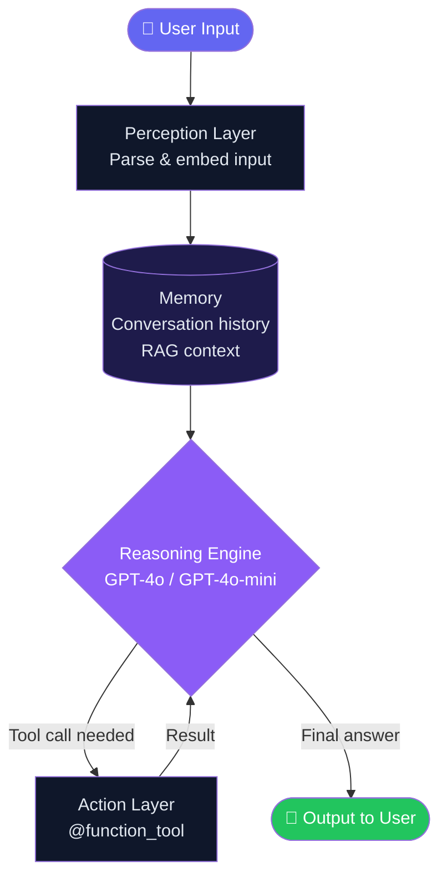
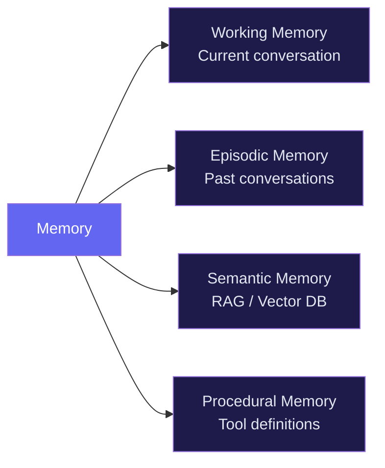

import FlashCardDeck from '@site/src/components/FlashCard';
import Quiz from '@site/src/components/Quiz';


# Agent Architecture

:::tip Learning Objectives — ⏱️ 20 min
- Understand the internal structure of an AI agent
- Learn how perception, memory, reasoning, and action work together
- Map the OpenAI Agents SDK components to the architecture
:::

## The Four Pillars

Every AI agent is built from four interconnected layers:

<div style={{display:"grid",gridTemplateColumns:"repeat(auto-fit,minmax(200px,1fr))",gap:"12px",margin:"24px 0"}}>
  {[
    {icon:"👁️",title:"Perception",desc:"Receives & parses user input",sdk:"Runner.run(agent, input)",color:"#6366f1"},
    {icon:"🗄️",title:"Memory",desc:"Stores context & history",sdk:"context object + RAG",color:"#8b5cf6"},
    {icon:"🧠",title:"Reasoning",desc:"Decides what to do next",sdk:"GPT-4o / GPT-4o-mini",color:"#a855f7"},
    {icon:"⚡",title:"Action",desc:"Executes tools & APIs",sdk:"@function_tool",color:"#c084fc"},
  ].map((p,i)=>(
    <div key={i} style={{background:`${p.color}15`,border:`1px solid ${p.color}50`,borderRadius:"12px",padding:"16px"}}>
      <div style={{fontSize:"1.8rem",marginBottom:"8px"}}>{p.icon}</div>
      <div style={{color:p.color,fontWeight:700,fontSize:"0.95rem",marginBottom:"4px"}}>{p.title}</div>
      <div style={{color:"#94a3b8",fontSize:"0.82rem",marginBottom:"8px"}}>{p.desc}</div>
      <code style={{background:"#0f172a",color:"#c084fc",padding:"3px 8px",borderRadius:"6px",fontSize:"0.75rem"}}>{p.sdk}</code>
    </div>
  ))}
</div>

| Layer | Role | SDK Component |
|---|---|---|
| **Perception** | Receives inputs | `Runner.run(agent, input)` |
| **Memory** | Stores context | `context` object |
| **Reasoning** | Decides next action | LLM (GPT-4o) |
| **Action** | Executes tools | `@function_tool` |

## Architecture Diagram



## The Reasoning-Action Loop

The core of every agent is a continuous loop:

```python
# Simplified agentic loop pseudocode
while not done:
    thought = llm.think(messages + memory)   # Reasoning
    if thought.is_tool_call:
        result = tool.execute(thought.args)   # Action
        memory.append(result)                 # Perception
    else:
        return thought.content               # Final answer
```

## Memory Types



---

## 🃏 Flash Cards

<FlashCardDeck title="Agent Architecture" cards={[
  { question: "What are the four pillars of agent architecture?", answer: "Perception (receives inputs), Memory (stores context), Reasoning (LLM decides), Action (executes tools). Together they form a complete autonomous system." },
  { question: "What is the role of the Reasoning Engine?", answer: "The LLM (e.g. GPT-4o) reads all available context and memory, then decides: call a tool OR produce the final answer. It runs in a loop until the task is complete." },
  { question: "What is Working Memory in an AI Agent?", answer: "The current conversation thread — all messages, tool calls, and results from the ongoing session. It's what the LLM sees when it reasons." },
  { question: "What is Semantic Memory?", answer: "A vector database (like Qdrant) that stores course content as embeddings. The agent searches it via RAG to answer questions using specific knowledge." },
  { question: "How does the Action Layer connect back to Reasoning?", answer: "Tool results are added back into the conversation context. The LLM then reads those results and decides the next step — this creates the agentic loop." },
]} />

---

## 📝 Quiz

<Quiz title="Agent Architecture Quiz" questions={[
  { question: "Which layer of an agent decides whether to call a tool or give a final answer?", options: ["Perception Layer", "Memory Layer", "Reasoning Engine (LLM)", "Action Layer"], correct: 2, explanation: "The LLM is the brain — it reads all context and makes the decision to either call a tool (action) or produce a final answer." },
  { question: "In the OpenAI Agents SDK, how is the Action Layer implemented?", options: ["Using class inheritance", "Via @function_tool decorated Python functions", "Through REST API calls only", "With SQL stored procedures"], correct: 1, explanation: "@function_tool turns any Python function into a tool the agent can call. It auto-generates the JSON schema from your type hints." },
  { question: "What is the purpose of Semantic Memory (RAG)?", options: ["Store the user's login credentials", "Cache LLM responses for speed", "Search a vector database to give the agent domain-specific knowledge", "Log errors to a database"], correct: 2, explanation: "RAG (Retrieval-Augmented Generation) lets agents search a vector DB like Qdrant to find relevant knowledge before answering — making answers accurate and grounded." },
  { question: "What happens after a tool returns its result in the agentic loop?", options: ["The loop ends", "The result is discarded", "The result is added to context and the LLM reasons again", "A new agent is created"], correct: 2, explanation: "Tool results flow back into the conversation context. The LLM then reads them in the next reasoning step — this is what makes the loop work." },
]} />
