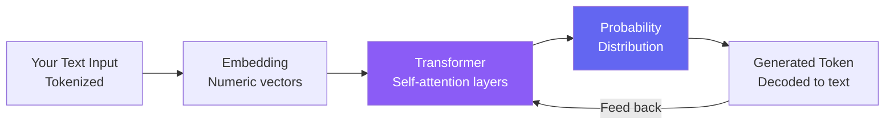

import FlashCardDeck from '@site/src/components/FlashCard';
import Quiz from '@site/src/components/Quiz';

# LLM Basics for Agent Builders

:::tip Learning Objectives — ⏱️ 20 min
- Understand what LLMs are and how they generate text token by token
- Learn key parameters: temperature, max_tokens, context window
- Understand why model choice matters for agents
- Write effective system prompts
:::

## What is an LLM?

A **Large Language Model (LLM)** is a neural network trained on hundreds of billions of words of text — books, websites, code, research papers. Through this training, it learns patterns about language, facts about the world, and how to reason step by step.

But here's the crucial thing to understand: **an LLM does not "know" things the way a database does**. It has compressed statistical patterns. When you ask it a question, it doesn't look up an answer — it *predicts* the most likely next sequence of tokens given everything it has seen.

This is both a strength (incredibly flexible, generalizes to new situations) and a weakness (can hallucinate, uncertain about precise facts, bad at arithmetic).

### The Prediction Machine

Every LLM output is a **probability distribution over the vocabulary** at each step:

```
Input:  "The capital of France is"
Output probabilities:
  "Paris"    → 96.2%
  "Lyon"     → 1.1%
  "London"   → 0.8%
  ...
```

The model picks a token from this distribution, appends it to the input, and repeats — one token at a time — until it decides to stop. This is called **autoregressive generation**.

This explains many LLM behaviors: why it sometimes makes things up (predicting what *sounds* right, not checking a database), and why "think step by step" helps (it primes better probability distributions).

---

## How Tokens Work

LLMs don't process characters or words — they process **tokens**. A token is roughly 4 characters or ¾ of a word.

```
"Hello, world!"      → ["Hello", ",", " world", "!"]     → 4 tokens
"Karachi"            → ["Kar", "achi"]                    → 2 tokens
```

**Why this matters for agents:**
- API pricing is per token (input + output)
- Context window limits are in tokens
- Long tool outputs consume your context budget fast

---

## How LLMs Generate Text



The **Transformer** is the core architecture. Its magic is **self-attention** — every token can "attend to" every other token in the context. This lets the model understand long-range relationships: knowing that "it" in sentence 10 refers to "the agent" from sentence 1.

For agent builders, you don't need to understand the math — but remember: longer context = slower and more expensive. Recent information gets slightly more "weight" — put the most important instructions last in your system prompt.

---

## Key Parameters Every Agent Builder Needs to Know

### 1. Temperature

**Temperature** controls how "creative" vs "deterministic" the output is.

<div style={{display:"flex",gap:"12px",margin:"16px 0",flexWrap:"wrap"}}>
  <div style={{flex:1,minWidth:"160px",background:"#0f172a",border:"1px solid #1e3a5f",borderRadius:"10px",padding:"14px",textAlign:"center"}}>
    <div style={{fontSize:"1.8rem",fontWeight:900,color:"#38bdf8"}}>0.0</div>
    <div style={{color:"#7dd3fc",fontWeight:600,fontSize:"0.85rem",margin:"4px 0"}}>Deterministic</div>
    <div style={{color:"#64748b",fontSize:"0.78rem"}}>Same input = same output every time. Most reliable for tools.</div>
    <div style={{color:"#0ea5e9",fontSize:"0.75rem",marginTop:"8px",fontWeight:600}}>✅ Use for: tools, code, JSON</div>
  </div>
  <div style={{flex:1,minWidth:"160px",background:"#0f172a",border:"1px solid #3730a3",borderRadius:"10px",padding:"14px",textAlign:"center"}}>
    <div style={{fontSize:"1.8rem",fontWeight:900,color:"#818cf8"}}>0.7</div>
    <div style={{color:"#a5b4fc",fontWeight:600,fontSize:"0.85rem",margin:"4px 0"}}>Balanced</div>
    <div style={{color:"#64748b",fontSize:"0.78rem"}}>Mix of reliability and variety. Good for most tasks.</div>
    <div style={{color:"#6366f1",fontSize:"0.75rem",marginTop:"8px",fontWeight:600}}>✅ Use for: tutors, assistants</div>
  </div>
  <div style={{flex:1,minWidth:"160px",background:"#0f172a",border:"1px solid #5b21b6",borderRadius:"10px",padding:"14px",textAlign:"center"}}>
    <div style={{fontSize:"1.8rem",fontWeight:900,color:"#c084fc"}}>1.0+</div>
    <div style={{color:"#d8b4fe",fontWeight:600,fontSize:"0.85rem",margin:"4px 0"}}>Creative</div>
    <div style={{color:"#64748b",fontSize:"0.78rem"}}>High variety. Different output every time.</div>
    <div style={{color:"#a855f7",fontSize:"0.75rem",marginTop:"8px",fontWeight:600}}>✅ Use for: stories, brainstorm</div>
  </div>
</div>

```python
from agents import Agent, ModelSettings

# For a reliable tool-calling agent — use low temperature
analyst = Agent(
    name="Data Analyst",
    model="gpt-4o-mini",
    model_settings=ModelSettings(temperature=0.1),
)

# For a creative writing agent — higher temperature
writer = Agent(
    name="Story Writer",
    model="gpt-4o-mini",
    model_settings=ModelSettings(temperature=0.9),
)
```

### 2. Context Window

The **context window** is the maximum text the model can see at once — system prompt + conversation history + tool results + response.

| Model | Context Window | Practical Use |
|---|---|---|
| GPT-4o-mini | 128,000 tokens | ~300 pages of text |
| GPT-4o | 128,000 tokens | ~300 pages of text |
| GPT-3.5-turbo | 16,000 tokens | ~40 pages |

**Agent context budget:** In a multi-turn conversation, context grows with every message and tool result. If each tool returns 500 tokens and you make 10 tool calls, that's 5,000 tokens just for tool results. Still well within 128K, but be mindful with long documents.

---

## Which Model Should You Use?

For this course we use **GPT-4o-mini** as the default:

| Factor | Why it Matters for Agents |
|---|---|
| **Speed** | Agents loop multiple times — slow model = bad UX |
| **Cost** | 1 user request may trigger 5-10 LLM calls — costs add up |
| **Tool calling** | GPT-4o-mini is excellent at structured JSON tool calls |
| **Context** | 128K tokens handles long agentic conversations |

Use **GPT-4o** when you need complex multi-step reasoning, long document analysis, or difficult coding tasks. The quality jump is real, but it costs ~10x more.

---

## System Prompts — Your Most Powerful Tool

The **system prompt** (`instructions` in the Agents SDK) defines your agent's identity, behavior, and constraints. A weak system prompt produces a generic, often useless agent. A strong one creates a focused, reliable expert.

```python
# ❌ Weak — too vague
agent = Agent(name="Helper", instructions="Help the user.")

# ✅ Strong — specific, structured, with rules
agent = Agent(
    name="Python Code Reviewer",
    instructions="""
    You are a senior Python engineer specializing in code review.

    Your job:
    - Review Python code for bugs, security issues, and performance problems
    - Always explain WHY something is a problem, not just that it is
    - Suggest the fix with a corrected code snippet
    - Rate severity: CRITICAL / HIGH / MEDIUM / LOW

    Rules:
    - Never guess — if uncertain, say so explicitly
    - Always check for: SQL injection, hardcoded secrets, unhandled exceptions
    - Format your review as a structured list, not a paragraph

    Tone: Professional but friendly. This is a learning opportunity.
    """,
    model="gpt-4o-mini",
)
```

### System Prompt Best Practices

1. **Define the role** — "You are a [specific expert] who [specific task]"
2. **List explicit rules** — what to always do, what to never do
3. **Define output format** — structured list, JSON, markdown, table
4. **Set the tone** — formal, friendly, concise, detailed
5. **Handle edge cases** — "If you don't know, say so rather than guessing"

---

## How the SDK Builds the API Request

When you call `Runner.run(agent, "user message")`, here is what gets sent to OpenAI internally:

```python
# What the SDK builds and sends:
messages = [
    { "role": "system",    "content": agent.instructions },
    { "role": "user",      "content": "user message" }
]

# After a tool call, it appends:
messages.append({ "role": "assistant", "tool_calls": [...] })
messages.append({ "role": "tool",      "content": "tool result" })

# Then calls the LLM again with the updated messages list
# This continues until no more tool calls are made
```

If your agent behaves strangely, the system prompt or tool result format is usually the culprit. Print `result.raw_responses` to inspect what the LLM actually saw.

---

## 🃏 Flash Cards

<FlashCardDeck title="LLM Basics" cards={[
  { question: "What does 'temperature' control in an LLM?", answer: "Randomness of output. Temperature 0 = deterministic (same answer every time). Temperature 1 = very creative/varied. For tool-calling agents, use low temperature (0.0–0.3) for consistency." },
  { question: "What is a 'context window'?", answer: "The maximum amount of text (in tokens) an LLM can process at once — including system prompt, history, tool results, and response. GPT-4o-mini has 128K tokens (~300 pages)." },
  { question: "Why is GPT-4o-mini preferred for agentic loops?", answer: "It's fast, cheap, and excellent at structured tool-calling. Since agents make many sequential LLM calls, using a fast/cheap model keeps costs low and latency acceptable." },
  { question: "What is a System Prompt?", answer: "A special instruction given to the LLM before the conversation. It defines the agent's role, rules, and behavior. In the Agents SDK it's the 'instructions' parameter. It's your most powerful tool for shaping agent behavior." },
  { question: "What is tokenization?", answer: "Splitting text into tokens (~4 chars each). LLMs process tokens, not characters. 1,000 tokens ≈ 750 words. Pricing is per token. Longer tool results = more tokens = more cost." },
  { question: "How does an LLM actually generate text?", answer: "It predicts a probability distribution over the vocabulary for the next token, samples from it, appends it to the input, and repeats — one token at a time. It's a prediction machine, not a lookup table." },
]} />

---

## 📝 Quiz

<Quiz title="LLM Basics Quiz" questions={[
  { question: "What temperature setting should you use for an agent reliably calling tools?", options: ["2.0 for maximum creativity", "0.0–0.3 for consistency", "It doesn't matter", "Always 1.0"], correct: 1, explanation: "Low temperature makes the LLM more deterministic — important when calling tools, following structured formats, or performing calculations where consistency matters." },
  { question: "Approximately how many words fit in GPT-4o-mini's 128K context window?", options: ["1,000 words", "10,000 words", "96,000 words", "1 million words"], correct: 2, explanation: "128K tokens ≈ 96,000 words or ~300 pages. This is huge — you can fit entire codebases or long research papers in a single prompt." },
  { question: "Where do you set an agent's persona and behavior rules in the OpenAI Agents SDK?", options: ["In a config.json file", "The 'instructions' parameter of Agent()", "In the tool function docstrings", "Via environment variables"], correct: 1, explanation: "The 'instructions' parameter is the system prompt — the most powerful way to control your agent's behavior, focus, and communication style." },
  { question: "Why do LLMs sometimes 'hallucinate' (make things up)?", options: ["They are programmed to lie", "They predict what sounds right statistically, not what is factually true", "Their training data is wrong", "Hallucination only happens with temperature > 1.0"], correct: 1, explanation: "LLMs are prediction machines — they generate the most statistically likely next token. If they don't 'know' something, they still predict something plausible. This is why grounding agents with real data tools (RAG, search) is so important." },
  { question: "What is the main advantage of a detailed, well-structured system prompt?", options: ["It makes the model faster", "It reduces API costs", "It shapes the agent's focus, output format, rules and behavior precisely", "It increases the context window"], correct: 2, explanation: "The system prompt defines everything about your agent's behavior. A detailed prompt with clear rules, output format, and role produces far more reliable and useful agents than a vague one." },
]} />
