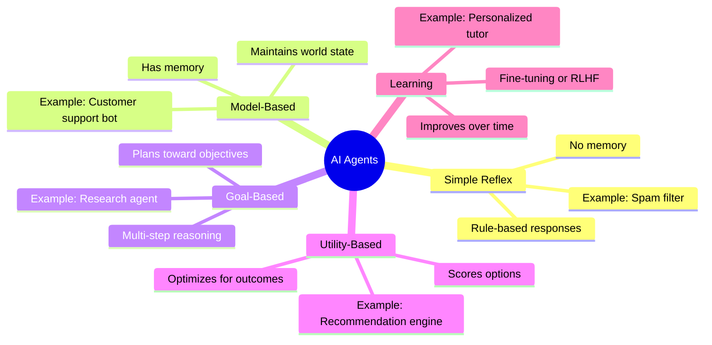

import FlashCardDeck from '@site/src/components/FlashCard';
import Quiz from '@site/src/components/Quiz';

# Types of AI Agents

:::tip Learning Objectives — ⏱️ 20 min
- Learn the 5 main types of AI agents and what makes each unique
- Understand which type to use for which problem
- See real production examples of each type
- Know where OpenAI Agents SDK fits in
:::

## Why Agent Types Matter

Before you build, you need to ask: *what kind of agent do I actually need?* Choosing the wrong type leads to over-engineering simple problems or under-engineering complex ones. A spam filter doesn't need multi-step planning. A research agent needs memory, planning, and tools. Understanding the taxonomy saves you hours of wasted work.

---

## The Five Types



---

## Type 1 — Simple Reflex Agent

The simplest possible agent. It maps **current input → action** using fixed rules. No memory of past interactions, no planning ahead.

**Analogy:** A thermostat. It checks the current temperature and turns the heater on or off. It doesn't remember yesterday's temperature. It doesn't plan for tomorrow.

**How it works:**
```
IF condition THEN action
IF email contains "buy now" AND "limited offer" THEN mark as spam
IF temperature < 20°C THEN turn on heater
IF user asks "hello" THEN respond "Hi, how can I help?"
```

**Real examples:**
- Email spam filters
- Traffic light controllers
- Simple FAQ chatbots ("What are your hours?" → fixed answer)
- Auto-responders

**When to use it:** When the problem has clear, finite rules and doesn't require remembering previous interactions. Fast, cheap, and predictable.

**Limitation:** Completely breaks on any input it wasn't explicitly programmed for. Zero adaptability.

---

## Type 2 — Model-Based Agent

Upgrades Simple Reflex by adding **an internal model of the world** — it tracks state between interactions. It remembers what happened before and uses that to make better decisions.

**Analogy:** A customer support agent who takes notes. They remember: "This customer complained about shipping last week, is in the Premium tier, and has 2 open tickets." Every new message is interpreted in context.

**How it works:**
```
World State = { user_tier: "premium", open_tickets: 2, last_issue: "shipping", sentiment: "frustrated" }

IF new_message AND user_tier == "premium" AND sentiment == "frustrated"
THEN escalate_to_human_agent()
```

**Real examples:**
- Customer support bots with conversation history
- Game NPCs that remember player actions
- Shopping assistants that track browsing history
- Personal finance trackers

```python
# Model-Based agent with context tracking
agent = Agent(
    name="Support Agent",
    instructions="""
    You are a customer support agent. You have access to the customer's history.
    Always reference previous interactions when relevant.
    If sentiment is negative and this is the 2nd+ complaint, offer compensation.
    """,
    tools=[get_customer_history, create_ticket, process_refund],
)
```

---

## Type 3 — Goal-Based Agent ⭐ (What You'll Build in This Course)

The most commonly built type with modern AI frameworks. Goal-Based agents don't just react — they **plan a sequence of actions** to achieve a specific objective.

**Analogy:** A travel agent. You say "plan a 5-day trip to Istanbul under $1500." They don't immediately respond — they search flights, check hotels, calculate costs, consider your past preferences, and come back with a complete itinerary. They had a goal and worked backwards from it.

**How it works:**
```
Goal: "Research the top 3 Python web frameworks and write a comparison report"

Plan:
1. Search for "best Python web frameworks 2024"
2. Search for each framework's GitHub stars and documentation
3. Search for performance benchmarks
4. Write structured comparison report
5. Return final report to user
```

**Real examples:**
- Research assistants (search, summarize, synthesize)
- Coding agents (read codebase, identify bug, write fix, run tests)
- Data analysis agents (fetch data, clean it, analyze, visualize)
- Email drafting agents (read context, draft, review, send)

```python
# Goal-Based agent — the OpenAI Agents SDK default
agent = Agent(
    name="Research Assistant",
    instructions="""
    You are a thorough research assistant.
    When given a research question:
    1. Break it into sub-questions
    2. Search for each sub-question separately
    3. Cross-reference sources for accuracy
    4. Synthesize findings into a clear, structured report
    Always cite your sources.
    """,
    tools=[search_web, read_webpage, save_to_file],
    model="gpt-4o",
)

result = await Runner.run(agent, "Compare LangChain vs OpenAI Agents SDK for production use")
```

---

## Type 4 — Utility-Based Agent

Goes beyond goals by **quantifying how "good" each possible action is** and choosing the one with the highest score. It optimizes, not just plans.

**Analogy:** A stock trading algorithm. It doesn't just have a goal ("make money") — it scores every possible trade based on expected return, risk, market conditions, and portfolio balance, then executes the highest-scoring option.

**How it works:**
```
Options:
  Buy AAPL:  utility = 0.72 (high expected return, moderate risk)
  Buy TSLA:  utility = 0.61 (high return, high risk)
  Hold cash: utility = 0.45 (low return, no risk)

Action: Buy AAPL (highest utility)
```

**Real examples:**
- Recommendation engines (Netflix, Spotify, Amazon)
- Autonomous trading bots
- Route optimization (Uber, delivery apps)
- Ad bidding systems

**With OpenAI Agents SDK:**
```python
@function_tool
def score_options(options: list[str], criteria: str) -> str:
    """Score each option against the given criteria and return ranked list."""
    # LLM scores each option, returns structured ranking
    ...

utility_agent = Agent(
    name="Decision Optimizer",
    instructions="Always score all available options before choosing. Justify your scoring.",
    tools=[score_options, get_market_data, get_user_preferences],
)
```

---

## Type 5 — Learning Agent

The most sophisticated type. It **improves its own behavior over time** through experience — via fine-tuning, RLHF (Reinforcement Learning from Human Feedback), or in-context learning from past interactions.

**Analogy:** A new employee who gets better at their job every week. They remember which approaches worked, which failed, and adapt their strategy over time.

**How it works:**
- Observes outcomes of its actions
- Gets feedback (explicit: "thumbs up/down", or implicit: "user re-asked the question = bad answer")
- Updates its strategy (fine-tuning) or remembers what worked (memory system)

**Real examples:**
- ChatGPT itself (trained with RLHF on human feedback)
- Personalized tutoring systems
- Code completion that learns your style (GitHub Copilot)
- Recommendation systems that adapt to clicks

**In practice with the Agents SDK:**
```python
# Learning via persistent memory (in-context learning approach)
@function_tool
def remember_user_preference(preference: str) -> str:
    """Save a user preference to persistent storage for future sessions."""
    save_to_db(user_id, preference)
    return f"Remembered: {preference}"

@function_tool
def recall_user_preferences() -> str:
    """Retrieve all saved preferences for this user."""
    return get_from_db(user_id)

adaptive_agent = Agent(
    name="Personal Assistant",
    instructions="""
    At the start of each session, recall the user's preferences.
    After each interaction, save any new preferences you learn.
    Adapt your communication style based on what the user responds well to.
    """,
    tools=[remember_user_preference, recall_user_preferences],
)
```

---

## Comparison at a Glance

<div style={{overflowX:"auto",margin:"24px 0"}}>
<table style={{width:"100%",borderCollapse:"collapse",fontSize:"0.88rem"}}>
  <thead>
    <tr style={{background:"#1e1b4b"}}>
      <th style={{padding:"10px 14px",textAlign:"left",color:"#a5b4fc",borderBottom:"1px solid #3730a3"}}>Type</th>
      <th style={{padding:"10px 14px",textAlign:"center",color:"#a5b4fc",borderBottom:"1px solid #3730a3"}}>Memory</th>
      <th style={{padding:"10px 14px",textAlign:"center",color:"#a5b4fc",borderBottom:"1px solid #3730a3"}}>Planning</th>
      <th style={{padding:"10px 14px",textAlign:"center",color:"#a5b4fc",borderBottom:"1px solid #3730a3"}}>Learning</th>
      <th style={{padding:"10px 14px",textAlign:"left",color:"#a5b4fc",borderBottom:"1px solid #3730a3"}}>Best For</th>
    </tr>
  </thead>
  <tbody>
    {[
      ["Simple Reflex","❌","❌","❌","Fixed rules, FAQ bots, filters"],
      ["Model-Based","✅","❌","❌","Customer support, NPCs, state tracking"],
      ["Goal-Based","✅","✅","❌","Research, coding, data analysis"],
      ["Utility-Based","✅","✅","❌","Recommendations, trading, routing"],
      ["Learning","✅","✅","✅","Personalization, adaptive tutors"],
    ].map(([type,mem,plan,learn,best],i)=>(
      <tr key={i} style={{borderBottom:"1px solid #1e293b",background: i%2===0 ? "#0f0c1e" : "#0a0818"}}>
        <td style={{padding:"10px 14px",color:"#e2e8f0",fontWeight:600}}>{type}</td>
        <td style={{padding:"10px 14px",textAlign:"center"}}>{mem}</td>
        <td style={{padding:"10px 14px",textAlign:"center"}}>{plan}</td>
        <td style={{padding:"10px 14px",textAlign:"center"}}>{learn}</td>
        <td style={{padding:"10px 14px",color:"#94a3b8",fontSize:"0.82rem"}}>{best}</td>
      </tr>
    ))}
  </tbody>
</table>
</div>

---

## Where Does the OpenAI Agents SDK Fit?

The SDK primarily helps you build **Goal-Based agents**, with optional extensions toward Learning agents through memory tools.

- You define the **goal** in `instructions`
- The SDK handles the **planning loop** (ReAct loop)
- You provide the **tools** (actions the agent can take)
- You can add **memory tools** to move toward adaptive/learning behavior

Most real-world production agents are **hybrid** — they combine traits from multiple types. A customer support agent might be Model-Based (tracks customer state) + Goal-Based (plans resolution steps) + Learning (saves preferences between sessions).

---

## 🃏 Flash Cards

<FlashCardDeck title="Types of AI Agents" cards={[
  { question: "What is a Simple Reflex Agent?", answer: "The simplest type — responds based on current input only, with no memory or planning. Like an if-else rule system. Example: spam filter, thermostat. Fast and predictable but breaks on any input not explicitly programmed for." },
  { question: "What makes a Model-Based Agent better than Simple Reflex?", answer: "It maintains an internal model of the world — tracking state between interactions. It remembers past context and uses it to make better current decisions. Example: a support bot that remembers your previous complaints." },
  { question: "What is a Goal-Based Agent?", answer: "An agent that has memory AND plans multiple steps to achieve a specific objective. It works backwards from the goal, deciding which actions to take in sequence. This is what OpenAI Agents SDK primarily builds." },
  { question: "What makes a Utility-Based Agent different from Goal-Based?", answer: "It quantifies the 'utility' (value) of each possible action and chooses the highest-scoring option. Not just 'reach the goal' but 'reach it in the optimal way'. Used in trading, routing, and recommendation systems." },
  { question: "How does a Learning Agent improve over time?", answer: "It observes outcomes, receives feedback, and updates its strategy — via fine-tuning (model weights change) or persistent memory (it remembers what worked). Example: ChatGPT trained with RLHF, or a personal assistant that remembers your preferences." },
  { question: "Which agent type does the OpenAI Agents SDK primarily help build?", answer: "Goal-Based Agents — they have conversation memory, reason about multi-step plans, and use tools to complete complex objectives. You can extend them toward Learning agents by adding persistent memory tools." },
]} />

---

## 📝 Quiz

<Quiz title="Types of Agents Quiz" questions={[
  { question: "A spam filter that checks for keywords is which type of agent?", options: ["Goal-Based", "Learning", "Simple Reflex", "Utility-Based"], correct: 2, explanation: "Simple Reflex agents react to current input with fixed rules — no memory, no planning. A keyword-based spam filter fits this perfectly." },
  { question: "Which agent type would you use to build a financial trading bot that maximizes profit?", options: ["Simple Reflex", "Goal-Based", "Utility-Based", "Model-Based only"], correct: 2, explanation: "Utility-Based agents score each possible action by its expected value and choose the best one — perfect for optimization tasks like trading where you need to compare and rank options." },
  { question: "A customer support bot that remembers a customer complained about shipping last week is which type?", options: ["Simple Reflex", "Model-Based", "Utility-Based", "Learning"], correct: 1, explanation: "Model-Based agents maintain an internal world state — tracking context between interactions. Remembering past complaints to inform current responses is exactly what Model-Based agents do." },
  { question: "What capability distinguishes a Goal-Based agent from a Model-Based agent?", options: ["Goal-Based agents have no memory", "Goal-Based agents plan and take multi-step actions toward objectives", "Goal-Based agents are simpler", "Goal-Based agents can't use tools"], correct: 1, explanation: "Model-Based agents track world state but don't plan sequences of actions. Goal-Based agents actively reason about what steps to take to achieve a specific goal — that's the key difference." },
  { question: "In the OpenAI Agents SDK, which parameter defines the agent's goal and behavior?", options: ["model", "tools", "instructions", "name"], correct: 2, explanation: "The 'instructions' parameter is the system prompt that defines what goal the agent is working toward, how it should behave, what rules to follow, and what format to use for its outputs." },
]} />
