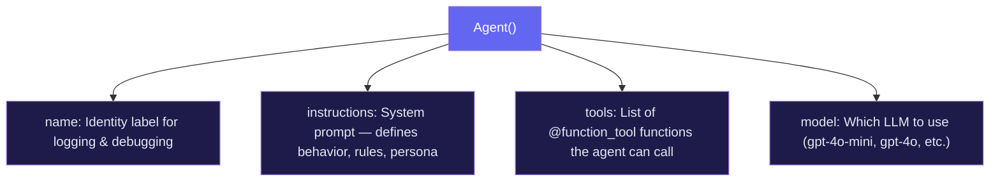
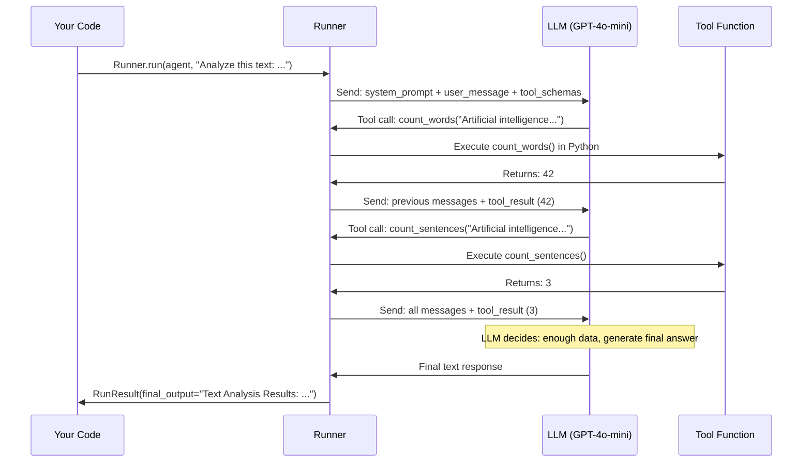

import FlashCardDeck from '@site/src/components/FlashCard';
import Quiz from '@site/src/components/Quiz';

# Building Your First Agent

:::tip Learning Objectives — ⏱️ 30 min
- Understand every parameter of the Agent() constructor
- Build a complete working agent with custom tools
- Read and understand agent responses
- Know what happens under the hood during Runner.run()
:::

## The Agent Constructor — Every Parameter Explained

Before writing any code, let's understand exactly what an `Agent()` is and what each parameter does.



```python
from agents import Agent

agent = Agent(
    name="My Agent",           # Used in logs and traces — choose descriptively
    instructions="...",        # System prompt — the MOST important parameter
    tools=[tool1, tool2],      # Python functions the agent can call
    model="gpt-4o-mini",       # LLM to use — gpt-4o-mini is fast and cheap
)
```

**The `instructions` parameter is your most powerful lever.** A vague instruction produces a useless agent. A specific, structured instruction produces a focused expert. We'll look at good vs bad examples shortly.

### Full Agent Configuration Reference

From the [official OpenAI Agents SDK docs](https://openai.github.io/openai-agents-python/agents/), here is every available parameter:

| Property | Required | Description |
|---|---|---|
| `name` | ✅ yes | Human-readable label used in logs and traces. |
| `instructions` | no | System prompt or dynamic callback. Strongly recommended. |
| `handoffs` | no | List of agents this agent can delegate the conversation to. |
| `model` | no | Which LLM to use (e.g. `"gpt-4o-mini"`, `"gpt-4o"`). |
| `model_settings` | no | Fine-tune temperature, top_p, tool_choice, etc. |
| `tools` | no | Python functions (decorated with `@function_tool`) the agent can call. |
| `mcp_servers` | no | MCP-backed tool servers. |
| `input_guardrails` | no | Checks that run on every user message before the agent sees it. |
| `output_guardrails` | no | Checks that run on the final output before it's returned. |
| `output_type` | no | Pydantic model for structured output instead of plain text. |
| `hooks` | no | Agent-scoped lifecycle callbacks (on_start, on_tool_start, etc.). |
| `tool_use_behavior` | no | What to do after a tool runs: continue or stop. |
| `reset_tool_choice` | no | Reset `tool_choice` to auto after a tool call (default: True). |

---

## The `@function_tool` Decorator — How It Works

The `@function_tool` decorator transforms a regular Python function into something the LLM can "see" and call.

When you decorate a function, the SDK does three things automatically:
1. Reads the **function name** → becomes the tool name
2. Reads the **docstring** → becomes the tool description (what the LLM reads to decide whether to call it)
3. Reads the **type hints** → becomes the JSON schema for the arguments

```python
from agents import function_tool

@function_tool
def get_weather(city: str) -> str:
    """Get the current weather for a given city."""
    # This docstring is what the LLM sees when deciding to call this tool!
    return f"Weather in {city}: 28°C, partly cloudy"

# What gets sent to the LLM internally:
# {
#   "name": "get_weather",
#   "description": "Get the current weather for a given city.",
#   "parameters": {
#     "type": "object",
#     "properties": {
#       "city": { "type": "string" }
#     },
#     "required": ["city"]
#   }
# }
```

:::tip Write great docstrings
The docstring IS the tool's documentation for the LLM. Be specific:
- ❌ `"""Get weather."""` — too vague
- ✅ `"""Get the current temperature, humidity, and conditions for any city worldwide."""` — clear and specific
:::

---

## Your First Complete Agent

Let's build a useful agent step by step — one that can analyze text in multiple ways.

```python
# first_agent.py
import asyncio
from dotenv import load_dotenv
from agents import Agent, Runner, function_tool

load_dotenv()

# ── Step 1: Define Tools ──────────────────────────────────────────────────────

@function_tool
def count_words(text: str) -> int:
    """Count the total number of words in a given text."""
    return len(text.split())

@function_tool
def count_sentences(text: str) -> int:
    """Count the number of sentences in a text (splits on . ! ?)."""
    import re
    sentences = re.split(r'[.!?]+', text.strip())
    return len([s for s in sentences if s.strip()])

@function_tool
def find_most_common_word(text: str) -> str:
    """Find the most frequently used word in a text."""
    from collections import Counter
    words = text.lower().split()
    if not words:
        return "No words found"
    word, count = Counter(words).most_common(1)[0]
    return f"'{word}' (appears {count} times)"

@function_tool
def summarize_stats(word_count: int, sentence_count: int, common_word: str) -> str:
    """Generate a human-readable summary from text statistics."""
    avg_words = round(word_count / sentence_count, 1) if sentence_count > 0 else 0
    return (
        f"Text has {word_count} words across {sentence_count} sentences "
        f"(avg {avg_words} words/sentence). Most common word: {common_word}."
    )

# ── Step 2: Create the Agent ──────────────────────────────────────────────────

agent = Agent(
    name="Text Analyzer",
    instructions="""
    You are a precise text analysis assistant.

    When asked to analyze text:
    1. Count the words using count_words
    2. Count the sentences using count_sentences
    3. Find the most common word using find_most_common_word
    4. Generate a summary using summarize_stats
    5. Present results in a clean, readable format

    Always use the tools for counting — never estimate.
    Be concise and professional in your responses.
    """,
    tools=[count_words, count_sentences, find_most_common_word, summarize_stats],
    model="gpt-4o-mini",
)

# ── Step 3: Run the Agent ─────────────────────────────────────────────────────

async def main():
    text = """
    Artificial intelligence is transforming every industry.
    From healthcare to finance, AI agents are automating complex tasks.
    The future belongs to those who can build and deploy intelligent systems.
    """

    result = await Runner.run(agent, f"Analyze this text: {text}")
    print(result.final_output)

asyncio.run(main())
```

**Expected output:**
```
Text Analysis Results:
- Words: 42
- Sentences: 3
- Average words per sentence: 14
- Most common word: 'ai' (appears 2 times)

Summary: Text has 42 words across 3 sentences (avg 14 words/sentence). 
Most common word: 'ai' (appears 2 times).
```

---

## What Happens Under the Hood

This is the most important thing to understand. When you call `Runner.run()`, here is the **exact sequence of events**:



Key insight: **the LLM never directly executes Python code.** It outputs a JSON structure requesting a tool call. Your code (the SDK's Runner) runs the actual function and feeds the result back. The LLM only sees text — it's your code that bridges the gap between LLM decisions and real-world actions.

---

## Reading the RunResult

`Runner.run()` returns a `RunResult` object with several useful properties:

```python
result = await Runner.run(agent, "Analyze this text: hello world")

# The agent's final answer
print(result.final_output)

# All messages including tool calls (great for debugging)
for msg in result.new_messages:
    print(f"{msg.role}: {msg.content}")

# How many LLM calls were made
print(f"Used {len(result.raw_responses)} LLM calls")
```

---

## Common Mistakes and How to Fix Them

<div style={{display:"flex",flexDirection:"column",gap:"12px",margin:"16px 0"}}>

<div style={{background:"#0c1a0c",border:"1px solid #166534",borderRadius:"10px",padding:"16px"}}>
  <div style={{color:"#4ade80",fontWeight:700,marginBottom:"8px"}}>✅ Good: Specific instructions with clear steps</div>

```python
instructions="""
You are a data analysis expert.
When analyzing data: 1) Calculate summary stats 2) Find outliers 3) Suggest visualizations
Always use tools for calculations — never estimate numbers.
"""
```
</div>

<div style={{background:"#1c0a0a",border:"1px solid #7f1d1d",borderRadius:"10px",padding:"16px"}}>
  <div style={{color:"#f87171",fontWeight:700,marginBottom:"8px"}}>❌ Bad: Vague instructions</div>

```python
instructions="Help the user with data."
# The agent won't know when to use tools or how to format output
```
</div>

<div style={{background:"#0c1a0c",border:"1px solid #166534",borderRadius:"10px",padding:"16px"}}>
  <div style={{color:"#4ade80",fontWeight:700,marginBottom:"8px"}}>✅ Good: Descriptive docstrings</div>

```python
@function_tool
def search_products(query: str, max_price: float = 100.0) -> list[dict]:
    """Search the product catalog for items matching the query within a price limit.
    Returns a list of products with name, price, and availability."""
    ...
```
</div>

<div style={{background:"#1c0a0a",border:"1px solid #7f1d1d",borderRadius:"10px",padding:"16px"}}>
  <div style={{color:"#f87171",fontWeight:700,marginBottom:"8px"}}>❌ Bad: No docstring</div>

```python
@function_tool
def search_products(query: str, max_price: float = 100.0) -> list[dict]:
    # The LLM has no idea what this does or when to call it!
    ...
```
</div>

</div>

---

## Challenge: Build a Calculator Agent

Now it's your turn. Build an agent that can solve word problems using math tools:

```python
# Challenge: make this work
result = await Runner.run(
    calc_agent,
    "If I have 150 apples and give away 1/3, then buy 40 more, how many do I have?"
)
# Expected: "You would have 140 apples."
```

**Hints:**
- Create tools for: `add`, `subtract`, `multiply`, `divide`
- In your instructions, tell the agent to break word problems into steps
- Think about what happens if someone asks to divide by zero!

---

## Dynamic Instructions

Instructions don't have to be a static string. You can pass a **function** that receives the current context and agent — useful for injecting user-specific data at runtime:

```python
from agents import Agent, Runner
from agents.run_context import RunContextWrapper
from dataclasses import dataclass

@dataclass
class UserContext:
    name: str
    is_pro: bool

def dynamic_instructions(
    context: RunContextWrapper[UserContext], agent: Agent
) -> str:
    user = context.context
    tier = "Pro" if user.is_pro else "Free"
    return f"You are helping {user.name} (plan: {tier}). Adjust your response accordingly."

agent = Agent[UserContext](
    name="Smart Assistant",
    instructions=dynamic_instructions,  # function instead of string!
)

result = await Runner.run(
    agent,
    "How many API calls can I make?",
    context=UserContext(name="Donia", is_pro=True),
)
print(result.final_output)
```

Both regular (`def`) and async (`async def`) functions are accepted.

---

## Lifecycle Hooks — Observing Your Agent

Sometimes you want to log events, pre-fetch data, or measure performance during an agent run. The SDK provides **two hook scopes**:

- `RunHooks` — observe the entire `Runner.run()` call including handoffs
- `AgentHooks` — attached to a specific agent via `agent.hooks`

```python
from agents import Agent, RunHooks, Runner

class LoggingHooks(RunHooks):
    async def on_agent_start(self, context, agent):
        print(f"🚀 Agent starting: {agent.name}")

    async def on_llm_end(self, context, agent, response):
        print(f"🧠 LLM produced {len(response.output)} output items")

    async def on_tool_start(self, context, agent, tool):
        print(f"🔧 Tool starting: {tool.name}")

    async def on_tool_end(self, context, agent, tool, result):
        print(f"✅ Tool done: {tool.name} → {result}")

    async def on_agent_end(self, context, agent, output):
        print(f"🏁 Agent finished | Tokens used: {context.usage}")


agent = Agent(name="Assistant", instructions="Be concise.")
result = await Runner.run(agent, "What's 2+2?", hooks=LoggingHooks())
print(result.final_output)
```

Use `RunHooks` when you want a single observer for the whole workflow. Use `AgentHooks` when one specific agent needs custom side effects.

---

## Tool Use Behavior — Controlling the Loop

By default, after a tool runs its result goes back to the LLM which decides what to do next. You can override this:

```python
from agents import Agent, function_tool
from agents.agent import StopAtTools

@function_tool
def get_price(product: str) -> float:
    """Look up the current price for a product."""
    return 29.99

# Option 1: stop immediately after the first tool call
agent = Agent(
    name="Price Checker",
    instructions="Look up prices.",
    tools=[get_price],
    tool_use_behavior="stop_on_first_tool",   # tool output becomes final answer
)

# Option 2: stop only when a specific tool is called
agent2 = Agent(
    name="Selective Stopper",
    tools=[get_price],
    tool_use_behavior=StopAtTools(stop_at_tool_names=["get_price"]),
)
```

| `tool_use_behavior` value | What happens |
|---|---|
| `"run_llm_again"` (default) | Tool result → LLM processes → may call more tools |
| `"stop_on_first_tool"` | First tool output becomes the final answer immediately |
| `StopAtTools([...])` | Stop if any of the named tools run |

---

## Agent Cloning — Reusing Configuration

Use `agent.clone()` to duplicate an agent and override specific properties. Perfect for creating variants without repeating config:

```python
base_agent = Agent(
    name="Analyst",
    instructions="Analyze financial data.",
    model="gpt-4o-mini",
    tools=[get_data, calculate_stats],
)

# Specialized variant — same tools, different persona
senior_agent = base_agent.clone(
    name="Senior Analyst",
    instructions="Analyze financial data with extra rigor. Flag any anomalies.",
    model="gpt-4o",  # upgrade model for senior
)
```

---

## 🃏 Flash Cards

<FlashCardDeck title="First Agent" cards={[
  { question: "What is the minimum code needed to create an agent?", answer: "Agent(name='...', instructions='...', model='gpt-4o-mini'). Name for identification, instructions for behavior (system prompt), model for which LLM to use. Tools are optional." },
  { question: "How does the agent know what a tool does?", answer: "From the function's docstring and type hints. The SDK auto-generates a JSON schema from these — so always write clear, specific docstrings. The docstring IS the tool description the LLM reads." },
  { question: "Does the LLM directly execute Python code?", answer: "No. The LLM outputs a JSON tool call request. The SDK's Runner executes the actual Python function and feeds the result back as a message. The LLM only sees text." },
  { question: "What does @function_tool automatically generate?", answer: "A complete JSON schema for the tool: the tool name (from function name), description (from docstring), and parameter schema (from type hints). All automatically — no extra config needed." },
  { question: "How many times can an agent call tools in a single Runner.run()?", answer: "As many times as needed until the task is complete. There's no fixed limit — the LLM keeps calling tools and observing results until it decides it has enough information to give a final answer." },
]} />

---

## 📝 Quiz

<Quiz title="First Agent Quiz" questions={[
  { question: "What is used to auto-generate the tool's description for the LLM?", options: ["The function name only", "A separate config file", "The function's docstring and type hints", "A decorator parameter"], correct: 2, explanation: "The SDK reads your Python docstring and type annotations to create the JSON schema sent to the LLM. Write clear, specific docstrings — they directly affect whether the agent uses the tool correctly." },
  { question: "What does the LLM actually do when it 'calls a tool'?", options: ["It directly executes the Python function", "It outputs a JSON structure requesting the tool call; the SDK runs the actual function", "It sends an HTTP request to your function", "It generates Python code and runs it"], correct: 1, explanation: "The LLM only generates text — it outputs a JSON tool call request. The SDK's Runner intercepts this, runs your actual Python function, and feeds the result back to the LLM as a new message." },
  { question: "Which Agent() parameter is most important for shaping behavior?", options: ["name", "instructions", "model", "tools"], correct: 1, explanation: "'instructions' is the system prompt — it defines the agent's role, rules, output format, and what to do in edge cases. This is your primary lever for controlling agent behavior." },
  { question: "What does result.final_output contain?", options: ["Raw API response JSON", "The last tool call result", "The agent's final text answer after all tool calls", "The total token count"], correct: 2, explanation: "final_output is the completed answer — after all reasoning and tool-calling loops, this is the text the agent decided to return to the user." },
  { question: "What happens if your @function_tool has no docstring?", options: ["The SDK raises an error", "The tool still works fine", "The LLM has no description and may not know when or how to use the tool correctly", "The function is ignored"], correct: 2, explanation: "Without a docstring, the LLM has no description of what the tool does. It may call it incorrectly, not call it when it should, or call the wrong tool. Always write descriptive docstrings." },
]} />
