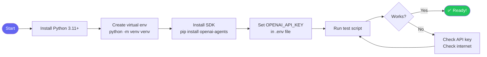

import FlashCardDeck from '@site/src/components/FlashCard';
import Quiz from '@site/src/components/Quiz';

# Setting Up Your Environment

:::tip Learning Objectives — ⏱️ 20 min
- Install Python 3.11+ and the OpenAI Agents SDK
- Understand why virtual environments matter
- Configure your API keys securely
- Run your first working health check
:::

## Why Environment Setup Matters

Before writing a single line of agent code, your environment needs to be right. Most beginners skip this and spend hours debugging problems that have nothing to do with their code — wrong Python version, missing packages, exposed API keys, or conflicting dependencies.

Getting this right once saves you enormous pain later.

---

## Setup Flow



---

## Step 1 — Python 3.11+

The OpenAI Agents SDK requires **Python 3.11 or higher**. It uses modern async/await patterns and type hints that don't work on older versions.

```bash
# Check your Python version
python3 --version
# Should show: Python 3.11.x or 3.12.x

# If you need to install Python 3.11+:
# Mac:     brew install python@3.11
# Ubuntu:  sudo apt install python3.11
# Windows: download from python.org
```

:::info Why Python 3.11 specifically?
Python 3.11 introduced significant performance improvements (10-60% faster than 3.10) and better error messages. The Agents SDK uses `asyncio.TaskGroup` which requires 3.11+.
:::

---

## Step 2 — Virtual Environment

A **virtual environment** is an isolated Python installation for your project. It prevents your agent project's packages from conflicting with other projects or your system Python.

**Think of it like this:** you're renting an apartment (virtual env) instead of living in a shared house (system Python). Your stuff stays separate from everyone else's.

```bash
# 1. Create a project folder
mkdir my-agent-project && cd my-agent-project

# 2. Create virtual environment
python3 -m venv venv

# 3. Activate it
source venv/bin/activate        # Mac/Linux
# venv\Scripts\activate.bat    # Windows CMD
# venv\Scripts\Activate.ps1    # Windows PowerShell

# You should now see (venv) at the start of your terminal prompt:
# (venv) user@machine:~/my-agent-project$
```

**Always activate your virtual environment** before working on the project. If you see import errors for `agents`, you probably forgot this step.

```bash
# Verify the right Python is active
which python3
# Should show: /path/to/my-agent-project/venv/bin/python3
```

---

## Step 3 — Install the SDK

```bash
# Make sure (venv) is active, then:
pip install openai-agents python-dotenv

# Verify installation
python3 -c "from agents import Agent, Runner; print('✅ SDK installed!')"
```

The `openai-agents` package includes:
- `Agent` — define your agent's behavior
- `Runner` — execute the agent loop
- `function_tool` — decorator to create tools
- Built-in tracing and streaming support

`python-dotenv` loads your `.env` file automatically so you never hardcode secrets.

---

## Step 4 — API Key Setup

Your **OpenAI API key** is your credential for the OpenAI API. It starts with `sk-` and looks like: `sk-proj-abc123...`

**Get your key:** [platform.openai.com/api-keys](https://platform.openai.com/api-keys) → "Create new secret key"

```bash
# Create .env file in your project root
touch .env
```

Add this to your `.env` file:
```
OPENAI_API_KEY=sk-proj-your-actual-key-here
```

:::danger Never expose your API key!
If your API key is exposed publicly, anyone can use it — and OpenAI bills **you** for their usage. This is a common and costly mistake.

```bash
# ALWAYS add .env to .gitignore immediately
echo ".env" >> .gitignore
echo "venv/" >> .gitignore
```

Never hardcode keys in Python files. Never commit `.env` to Git. Never share your key in screenshots.
:::

---

## Step 5 — Load Keys in Python

```python
# At the top of every agent script:
from dotenv import load_dotenv
import os

load_dotenv()  # loads .env file into environment variables

# The SDK reads OPENAI_API_KEY automatically from environment
# You don't need to pass it explicitly to Agent()
```

---

## Step 6 — Verify Everything Works

Create `test.py` and run it:

```python
# test.py
import asyncio
from dotenv import load_dotenv
from agents import Agent, Runner

load_dotenv()

agent = Agent(
    name="Health Check",
    instructions="Respond with exactly: 'Environment setup successful! Ready to build agents.'",
    model="gpt-4o-mini",
)

async def main():
    result = await Runner.run(agent, "ping")
    print(result.final_output)

asyncio.run(main())
```

```bash
python3 test.py
# Expected output:
# Environment setup successful! Ready to build agents.
```

---

## Troubleshooting Common Issues

<div style={{display:"flex",flexDirection:"column",gap:"12px",margin:"16px 0"}}>

<div style={{background:"#1c0a0a",border:"1px solid #7f1d1d",borderRadius:"10px",padding:"16px"}}>
  <div style={{color:"#f87171",fontWeight:700,marginBottom:"6px"}}>❌ ModuleNotFoundError: No module named 'agents'</div>
  <div style={{color:"#fca5a5",fontSize:"0.88rem"}}>Your virtual environment isn't activated. Run: <code>source venv/bin/activate</code></div>
</div>

<div style={{background:"#1c0a0a",border:"1px solid #7f1d1d",borderRadius:"10px",padding:"16px"}}>
  <div style={{color:"#f87171",fontWeight:700,marginBottom:"6px"}}>❌ openai.AuthenticationError: Invalid API key</div>
  <div style={{color:"#fca5a5",fontSize:"0.88rem"}}>Check your .env file — make sure OPENAI_API_KEY has no extra spaces or quotes. Run: <code>cat .env</code></div>
</div>

<div style={{background:"#1c0a0a",border:"1px solid #7f1d1d",borderRadius:"10px",padding:"16px"}}>
  <div style={{color:"#f87171",fontWeight:700,marginBottom:"6px"}}>❌ openai.RateLimitError: You exceeded your quota</div>
  <div style={{color:"#fca5a5",fontSize:"0.88rem"}}>Your OpenAI account has $0 credit. Add credits at platform.openai.com/billing</div>
</div>

<div style={{background:"#1c0a0a",border:"1px solid #7f1d1d",borderRadius:"10px",padding:"16px"}}>
  <div style={{color:"#f87171",fontWeight:700,marginBottom:"6px"}}>❌ SyntaxError on async/await</div>
  <div style={{color:"#fca5a5",fontSize:"0.88rem"}}>You're on Python 3.10 or lower. Run: <code>python3 --version</code> and upgrade to 3.11+</div>
</div>

</div>

---

## Project Structure Best Practice

```
my-agent-project/
├── .env              ← API keys (NEVER commit this)
├── .gitignore        ← includes .env and venv/
├── venv/             ← virtual environment (NEVER commit)
├── main.py           ← your agent code
├── tools/
│   ├── __init__.py
│   └── search.py     ← custom tools
└── requirements.txt  ← pip freeze > requirements.txt
```

```bash
# Save your dependencies so others can reproduce your env
pip freeze > requirements.txt

# Others can then recreate your environment with:
pip install -r requirements.txt
```

---

## 🃏 Flash Cards

<FlashCardDeck title="Environment Setup" cards={[
  { question: "Why use a virtual environment?", answer: "To isolate project dependencies — each project gets its own Python packages without conflicting with other projects or system Python. Always activate it before working." },
  { question: "What command activates a virtual environment on Mac/Linux?", answer: "source venv/bin/activate — You should see (venv) in your terminal prompt confirming it's active. If you see import errors, you probably forgot this step." },
  { question: "Where should your OPENAI_API_KEY be stored?", answer: "In a .env file in your project root. Load it with python-dotenv (load_dotenv()). NEVER hardcode it in source files or commit it to Git — add .env to .gitignore." },
  { question: "What is the minimum Python version for the OpenAI Agents SDK?", answer: "Python 3.11 or higher. The SDK uses asyncio.TaskGroup and modern type hints requiring 3.11+. Check with: python3 --version" },
  { question: "What does Runner.run() return?", answer: "A RunResult object. Access result.final_output for the agent's final text response, or result.new_messages for the full message history including all tool calls." },
  { question: "What command saves your project dependencies?", answer: "pip freeze > requirements.txt — This saves the exact package versions. Others can recreate your environment with: pip install -r requirements.txt" },
]} />

---

## 📝 Quiz

<Quiz title="Environment Setup Quiz" questions={[
  { question: "Why should you never commit your .env file to Git?", options: ["It makes the repo too large", "Your secret API keys would be exposed — anyone could use them and charge your account", "Git doesn't support .env files", "It causes merge conflicts"], correct: 1, explanation: "API keys are credentials. Committing them publicly exposes your account to abuse and can result in unexpected large charges. Always add .env to .gitignore immediately." },
  { question: "What Python command creates a virtual environment named 'venv'?", options: ["pip install venv", "python3 -m venv venv", "virtualenv create", "conda env create"], correct: 1, explanation: "python3 -m venv venv uses Python's built-in venv module to create an isolated environment in the 'venv' folder. No additional packages needed." },
  { question: "What does result.final_output contain after Runner.run()?", options: ["The raw JSON from OpenAI API", "The agent's final text answer", "A list of all tool calls made", "The token count used"], correct: 1, explanation: "final_output is the agent's completed answer — after all tool calls and reasoning steps, this is the final text response." },
  { question: "What error means your virtual environment isn't activated?", options: ["AuthenticationError", "ModuleNotFoundError: No module named 'agents'", "RateLimitError", "SyntaxError"], correct: 1, explanation: "If the agents module isn't found, Python is looking in the wrong place — your venv isn't active. Run: source venv/bin/activate" },
  { question: "Why does the OpenAI Agents SDK require Python 3.11+?", options: ["OpenAI only supports 3.11", "It uses asyncio.TaskGroup and modern type hints only available in 3.11+", "Python 3.10 is deprecated", "Virtual environments need 3.11"], correct: 1, explanation: "The SDK uses asyncio.TaskGroup (3.11 feature) for concurrent tool execution, and modern Python type hints for the function_tool decorator's schema generation." },
]} />
