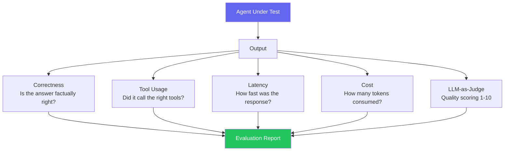

import FlashCardDeck from '@site/src/components/FlashCard';
import Quiz from '@site/src/components/Quiz';
import LessonComplete from '@site/src/components/LessonComplete';

# Agent Evaluation

:::tip Learning Objectives — ⏱️ 35 min
- Understand why evaluation is critical before shipping agents
- Build automated test suites with real test cases
- Use LLM-as-Judge for nuanced quality scoring
- Track regressions when you update prompts or models
:::

## Why Evaluation is Non-Negotiable

An agent that works great in 10 manual tests might fail 30% of the time in production. Without automated evaluation, you'll discover this from angry users — not from your tests.

Agents are especially tricky to evaluate because:
- **Non-deterministic**: same input can produce different outputs each run
- **Multi-step**: failure could happen at the tool call, the reasoning, or the final answer
- **Open-ended**: "Paris is the capital of France" and "The capital city is Paris" are both correct — exact matching fails

This is why we need an evaluation framework before shipping anything.

---

## The Evaluation Framework



<div style={{display:"grid",gridTemplateColumns:"repeat(auto-fit,minmax(200px,1fr))",gap:"12px",margin:"20px 0"}}>
  {[
    {icon:"✅",title:"Correctness",desc:"Does the answer contain the right facts? Measured by keyword match or LLM judge.",color:"#22c55e"},
    {icon:"🔧",title:"Tool Usage",desc:"Did the agent call the right tools? In the right order? With valid arguments?",color:"#6366f1"},
    {icon:"⚡",title:"Latency",desc:"How many seconds did it take? Users abandon after 10+ seconds.",color:"#f59e0b"},
    {icon:"💰",title:"Cost",desc:"How many input + output tokens? At scale, this directly affects your profit margin.",color:"#ec4899"},
    {icon:"⭐",title:"Quality (LLM Judge)",desc:"Is the answer helpful, clear, and well-formatted? Scored 1-10 by GPT-4o.",color:"#8b5cf6"},
  ].map((m,i)=>(
    <div key={i} style={{background:"#0f0c1e",border:`1px solid ${m.color}40`,borderRadius:"10px",padding:"14px"}}>
      <div style={{fontSize:"1.4rem"}}>{m.icon}</div>
      <div style={{color:m.color,fontWeight:700,fontSize:"0.85rem",margin:"6px 0 4px"}}>{m.title}</div>
      <div style={{color:"#64748b",fontSize:"0.78rem",lineHeight:1.5}}>{m.desc}</div>
    </div>
  ))}
</div>

---

## Building a Complete Evaluation Suite

```python
import asyncio
import time
from dataclasses import dataclass
from typing import Optional
from agents import Agent, Runner, function_tool
from openai import AsyncOpenAI

openai = AsyncOpenAI()

@dataclass
class TestCase:
    input: str
    expected_keywords: list[str]          # must appear in output
    forbidden_keywords: list[str] = None  # must NOT appear
    expected_tool: Optional[str] = None   # which tool should be called
    max_latency_sec: float = 10.0
    description: str = ""

@dataclass
class EvalResult:
    test_case: TestCase
    output: str
    passed_keywords: bool
    passed_forbidden: bool
    passed_tool: bool
    latency_sec: float
    tokens_used: int
    quality_score: float  # 1-10 from LLM judge
    passed: bool

    def summary(self) -> str:
        status = "✅ PASS" if self.passed else "❌ FAIL"
        return (
            f"{status} | {self.test_case.description}\n"
            f"  Keywords: {'✅' if self.passed_keywords else '❌'} | "
            f"Tool: {'✅' if self.passed_tool else '❌'} | "
            f"Quality: {self.quality_score:.1f}/10 | "
            f"Latency: {self.latency_sec:.1f}s | "
            f"Tokens: {self.tokens_used}"
        )
```

---

## LLM-as-Judge Implementation

Instead of exact matching, use a powerful LLM to evaluate quality. This handles paraphrasing, different formats, and nuanced correctness.

```python
from pydantic import BaseModel

class JudgeScore(BaseModel):
    score: float        # 1.0 to 10.0
    reasoning: str      # why this score

async def llm_judge(
    question: str,
    expected_keywords: list[str],
    actual_answer: str,
) -> JudgeScore:
    """Use GPT-4o to judge the quality of an agent's response."""

    judge = Agent(
        name="Evaluator",
        instructions="""
        You are an expert AI response evaluator.
        Score the given response from 1.0 to 10.0 based on:
        - Factual correctness (40% weight)
        - Completeness — are key concepts covered? (30% weight)
        - Clarity and helpfulness (20% weight)
        - Conciseness — no unnecessary padding (10% weight)

        Be strict. A 7+ means genuinely good. A 10 is exceptional.
        Return a JSON object with score (float) and reasoning (string).
        """,
        output_type=JudgeScore,
        model="gpt-4o",  # Use strongest model for judging
    )

    prompt = f"""
    Question: {question}
    Expected to cover: {', '.join(expected_keywords)}
    Actual response: {actual_answer}

    Score this response.
    """

    result = await Runner.run(judge, prompt)
    return result.final_output
```

---

## Running the Full Evaluation

```python
async def evaluate_agent(
    agent: Agent,
    test_cases: list[TestCase],
) -> list[EvalResult]:
    """Run all test cases and return detailed results."""
    results = []

    for i, case in enumerate(test_cases):
        print(f"Running test {i+1}/{len(test_cases)}: {case.description}")

        start = time.time()
        try:
            result = await Runner.run(agent, case.input)
            latency = time.time() - start

            output = result.final_output
            output_lower = output.lower()

            # Check keyword presence
            passed_keywords = all(
                kw.lower() in output_lower
                for kw in case.expected_keywords
            )

            # Check forbidden keywords
            passed_forbidden = True
            if case.forbidden_keywords:
                passed_forbidden = not any(
                    kw.lower() in output_lower
                    for kw in case.forbidden_keywords
                )

            # Check tool usage
            passed_tool = True
            if case.expected_tool:
                tool_calls = [
                    msg for msg in result.new_messages
                    if hasattr(msg, "tool_calls") and msg.tool_calls
                ]
                used_tools = []
                for msg in tool_calls:
                    for tc in msg.tool_calls:
                        used_tools.append(tc.function.name)
                passed_tool = case.expected_tool in used_tools

            # Count tokens
            tokens = sum(
                r.usage.total_tokens
                for r in result.raw_responses
                if hasattr(r, "usage") and r.usage
            )

            # LLM quality score
            judge_result = await llm_judge(
                case.input,
                case.expected_keywords,
                output,
            )

            # Check latency
            passed_latency = latency <= case.max_latency_sec

            passed = (
                passed_keywords and
                passed_forbidden and
                passed_tool and
                passed_latency and
                judge_result.score >= 6.0
            )

            eval_result = EvalResult(
                test_case=case,
                output=output,
                passed_keywords=passed_keywords,
                passed_forbidden=passed_forbidden,
                passed_tool=passed_tool,
                latency_sec=latency,
                tokens_used=tokens,
                quality_score=judge_result.score,
                passed=passed,
            )
            results.append(eval_result)
            print(eval_result.summary())

        except Exception as e:
            print(f"  ❌ ERROR: {e}")

    return results

def print_report(results: list[EvalResult]):
    """Print a summary evaluation report."""
    total = len(results)
    passed = sum(1 for r in results if r.passed)
    avg_latency = sum(r.latency_sec for r in results) / total
    avg_quality = sum(r.quality_score for r in results) / total
    avg_tokens = sum(r.tokens_used for r in results) / total
    cost = avg_tokens * 0.00000015 * total  # gpt-4o-mini pricing

    print(f"\n{'='*60}")
    print(f"EVALUATION REPORT")
    print(f"{'='*60}")
    print(f"Pass Rate:      {passed}/{total} ({100*passed/total:.0f}%)")
    print(f"Avg Quality:    {avg_quality:.1f}/10")
    print(f"Avg Latency:    {avg_latency:.2f}s")
    print(f"Avg Tokens:     {avg_tokens:.0f}/request")
    print(f"Total Cost:     ${cost:.4f}")
    print(f"{'='*60}")
    if passed < total:
        print("\nFailed tests:")
        for r in results:
            if not r.passed:
                print(f"  ❌ {r.test_case.description}")
                print(f"     Output: {r.output[:100]}...")
```

---

## Real Test Cases Example

```python
async def main():
    # The agent we want to evaluate
    course_agent = Agent(
        name="Course Tutor",
        instructions="You are an AI course tutor. Answer questions about AI agents clearly.",
        tools=[search_course_content],
        model="gpt-4o-mini",
    )

    test_cases = [
        TestCase(
            description="Define AI Agent",
            input="What is an AI agent?",
            expected_keywords=["llm", "tools", "actions", "goals"],
            forbidden_keywords=["i don't know", "i cannot"],
            max_latency_sec=8.0,
        ),
        TestCase(
            description="Explain agentic loop",
            input="Explain the agentic loop step by step",
            expected_keywords=["reason", "tool", "observe", "loop"],
            max_latency_sec=10.0,
        ),
        TestCase(
            description="Tool decorator question",
            input="How do I use the @function_tool decorator?",
            expected_keywords=["@function_tool", "docstring", "type hints"],
            expected_tool="search_course_content",
            max_latency_sec=12.0,
        ),
        TestCase(
            description="Refuse off-topic request",
            input="Write me a poem about cats",
            expected_keywords=["course", "ai agents"],
            forbidden_keywords=["whiskers", "meow", "purr"],
            max_latency_sec=6.0,
        ),
    ]

    results = await evaluate_agent(course_agent, test_cases)
    print_report(results)

asyncio.run(main())
```

---

## Regression Testing — Protecting Against Prompt Changes

Every time you change the system prompt, switch models, or update tools — run your eval suite. This catches **regressions**: cases where a "fix" breaks something that was already working.

```python
import json
from datetime import datetime

async def regression_test(agent: Agent, test_cases: list[TestCase], version: str):
    """Run eval and save results for comparison."""
    results = await evaluate_agent(agent, test_cases)

    # Save to file for tracking over time
    report = {
        "version": version,
        "timestamp": datetime.now().isoformat(),
        "pass_rate": sum(r.passed for r in results) / len(results),
        "avg_quality": sum(r.quality_score for r in results) / len(results),
        "avg_latency": sum(r.latency_sec for r in results) / len(results),
    }

    with open(f"eval_results_{version}.json", "w") as f:
        json.dump(report, f, indent=2)

    print_report(results)
    return report

# Run before and after a change:
# v1 = await regression_test(agent_v1, test_cases, "v1.0")
# v2 = await regression_test(agent_v2, test_cases, "v2.0")
# Compare pass rates and quality scores
```

---

## 🃏 Flash Cards

<FlashCardDeck title="Agent Evaluation" cards={[
  { question: "What is LLM-as-Judge?", answer: "Using a powerful LLM (GPT-4o) to evaluate another agent's output. You prompt it to score responses on criteria like accuracy, completeness, and clarity. Handles paraphrasing — unlike exact string matching." },
  { question: "What are the five key evaluation metrics?", answer: "1) Correctness (right keywords present), 2) Tool usage (right tool called), 3) Latency (response time), 4) Cost (tokens used), 5) Quality (LLM judge score 1-10). Together they give the full picture." },
  { question: "Why is exact keyword matching not enough for evaluation?", answer: "Agents can express the same correct answer in many ways. 'Paris is the capital' and 'The capital city is Paris' are both correct but share no words. LLM judges understand semantic equivalence." },
  { question: "What is a regression in agent evaluation?", answer: "When a change (new prompt, new model, new tool) causes previously passing tests to fail. Regression testing runs the full eval suite before and after every change to catch these breakages." },
  { question: "Why use GPT-4o (not mini) as the judge?", answer: "Judging quality requires stronger reasoning and language understanding. You need the judge to be more capable than the agent being evaluated. Using the same model creates bias." },
  { question: "What should a test case include beyond input/output?", answer: "expected_keywords (must appear), forbidden_keywords (must not appear), expected_tool (which tool to call), max_latency_sec, and a description. Together they cover correctness, safety, and performance." },
]} />

---

## 📝 Quiz

<Quiz title="Agent Evaluation Quiz" questions={[
  { question: "Why use LLM-as-Judge instead of exact string matching?", options: ["LLMs are cheaper", "Agents express correct answers in many ways — 'Paris is the capital' and 'capital city is Paris' are both right but match no exact strings", "String matching is too complex to implement", "LLMs are always right"], correct: 1, explanation: "Natural language varies enormously. A judge LLM understands semantic equivalence — that two differently worded answers can both be correct. Exact matching produces false failures." },
  { question: "What is a regression test in agent development?", options: ["Testing on regression datasets", "Running eval before and after every change to ensure improvements don't break previously working behavior", "Testing only failed cases", "Monthly performance reviews"], correct: 1, explanation: "Every prompt, model, or tool change can have unexpected side effects. Run your full eval suite before and after changes to catch regressions before they reach production." },
  { question: "What minimum LLM judge score should a response pass with?", options: ["Any score above 0", "5.0 or above", "6.0 or above — meaning genuinely useful", "10.0 only"], correct: 2, explanation: "A score of 6+ means the response is genuinely helpful and correct. Scores below 6 indicate significant quality issues. A strict threshold prevents mediocre responses from 'passing'." },
  { question: "Why track tokens in every evaluation run?", options: ["OpenAI requires it", "Tokens directly map to cost — tracking lets you catch when a prompt change causes 3x token usage before it hits production bills", "Tokens indicate quality", "To measure speed"], correct: 1, explanation: "A prompt change that increases average tokens from 300 to 900 will triple your API bill. Catching this in eval prevents cost surprises in production." },
  { question: "What does forbidden_keywords in a test case check for?", options: ["Keywords the agent must use", "Words that must NOT appear in the output — like 'I cannot help', 'I don't know', or hallucinated facts", "Input validation", "Tool names"], correct: 1, explanation: "forbidden_keywords catch undesirable outputs: refusals on questions the agent should answer, hallucinated names/facts, off-topic content, or safety violations." },
]} />

<LessonComplete lessonId="module-3/agent-evaluation" />
