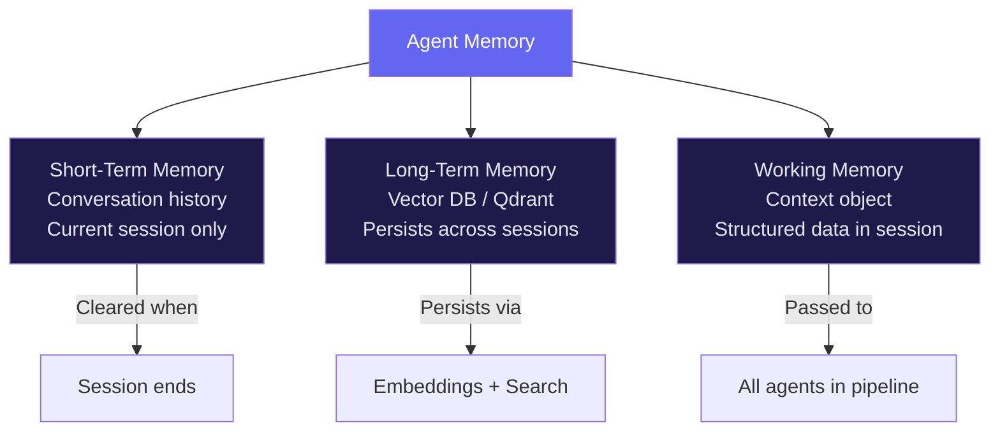

import FlashCardDeck from '@site/src/components/FlashCard';
import Quiz from '@site/src/components/Quiz';

# Memory Systems

:::tip Learning Objectives — ⏱️ 30 min
- Understand the three types of agent memory
- Implement conversation memory (short-term)
- Build persistent long-term memory with Qdrant
- Use context objects for structured working memory
:::

## Why Memory Matters

Without memory, every conversation starts from scratch. Ask an agent "what did we discuss last time?" and it has no idea. Ask it to "continue where we left off" — blank slate.

Memory transforms a one-shot tool into a genuine **intelligent assistant** that gets better with every interaction:
- Remembers your name, preferences, past problems
- Continues multi-session projects
- Learns from past mistakes
- Personalizes responses based on history

Think of it as the difference between a **stranger** (no memory) and a **colleague** (remembers your context, adapts to your style).

---

## Three Types of Memory



<div style={{display:"grid",gridTemplateColumns:"repeat(auto-fit,minmax(200px,1fr))",gap:"12px",margin:"20px 0"}}>
  <div style={{background:"#1e1b4b",border:"1px solid #4338ca",borderRadius:"12px",padding:"16px"}}>
    <div style={{fontSize:"1.5rem"}}>🧠</div>
    <div style={{color:"#a5b4fc",fontWeight:700,margin:"6px 0"}}>Short-Term</div>
    <div style={{color:"#6b7280",fontSize:"0.82rem"}}>Conversation history for the current session. Lives in memory (RAM). Gone when the server restarts or session ends.</div>
  </div>
  <div style={{background:"#1a1035",border:"1px solid #6d28d9",borderRadius:"12px",padding:"16px"}}>
    <div style={{fontSize:"1.5rem"}}>🗄️</div>
    <div style={{color:"#c084fc",fontWeight:700,margin:"6px 0"}}>Long-Term</div>
    <div style={{color:"#6b7280",fontSize:"0.82rem"}}>Stored in a vector database like Qdrant. Survives server restarts. Retrieved by semantic similarity, not exact keywords.</div>
  </div>
  <div style={{background:"#0f1f0f",border:"1px solid #166534",borderRadius:"12px",padding:"16px"}}>
    <div style={{fontSize:"1.5rem"}}>📋</div>
    <div style={{color:"#4ade80",fontWeight:700,margin:"6px 0"}}>Working Memory</div>
    <div style={{color:"#6b7280",fontSize:"0.82rem"}}>A typed Python object shared across all agents in a pipeline. Think of it as a "clipboard" for the current task.</div>
  </div>
</div>

---

## Type 1 — Short-Term Memory (Conversation History)

By default, each `Runner.run()` call is **stateless** — the agent has no memory of previous calls. To give it conversation memory, you maintain the message history and pass it back on every call.

```python
import asyncio
from agents import Agent, Runner
from openai.types.responses import ResponseInputItemParam

agent = Agent(
    name="Personal Assistant",
    instructions="You are a helpful assistant. Remember context from earlier in our conversation.",
    model="gpt-4o-mini",
)

# History accumulates across turns
history: list[ResponseInputItemParam] = []

async def chat(user_message: str) -> str:
    # Add the new user message to history
    history.append({"role": "user", "content": user_message})

    # Run agent with FULL history (not just the latest message)
    result = await Runner.run(agent, history)

    # Append the agent's response messages back to history
    history.extend(result.new_messages)

    return result.final_output

async def main():
    print(await chat("My name is Ahmed and I'm learning Python."))
    # "Nice to meet you, Ahmed! Python is a great choice..."

    print(await chat("What's my name?"))
    # "Your name is Ahmed!" ← remembers from previous turn

    print(await chat("What am I learning?"))
    # "You're learning Python!" ← still remembers

asyncio.run(main())
```

**Important:** The history list grows with every turn. For very long conversations (100+ turns), you may want to summarize or trim older messages to stay within the context window.

```python
def trim_history(history: list, max_turns: int = 20) -> list:
    """Keep only the most recent N turns to manage context window."""
    # Always keep the system context, trim only conversation turns
    if len(history) > max_turns * 2:
        return history[-(max_turns * 2):]
    return history
```

---

## Type 2 — Long-Term Memory (Vector Database)

Long-term memory persists across sessions using a **vector database**. The key insight: instead of searching by exact keyword, we search by **semantic similarity** using embeddings.

**How it works:**
1. Convert text to an embedding vector (list of ~1500 numbers)
2. Store the vector + original text in Qdrant
3. To search: embed the query, find vectors that are mathematically "close"
4. Close vectors = semantically similar content

```python
from qdrant_client import QdrantClient
from qdrant_client.models import Distance, VectorParams, PointStruct
from openai import OpenAI
import uuid
import os

openai = OpenAI()
qdrant = QdrantClient(url=os.getenv("QDRANT_URL"), api_key=os.getenv("QDRANT_API_KEY"))

MEMORY_COLLECTION = "user_memories"
VECTOR_SIZE = 1536  # text-embedding-3-small dimension

def setup_memory_collection():
    """Create the collection if it doesn't exist."""
    existing = [c.name for c in qdrant.get_collections().collections]
    if MEMORY_COLLECTION not in existing:
        qdrant.create_collection(
            collection_name=MEMORY_COLLECTION,
            vectors_config=VectorParams(size=VECTOR_SIZE, distance=Distance.COSINE),
        )
        print(f"Created collection: {MEMORY_COLLECTION}")

def embed(text: str) -> list[float]:
    """Convert text to embedding vector."""
    return openai.embeddings.create(
        model="text-embedding-3-small",
        input=text
    ).data[0].embedding

def save_memory(user_id: str, content: str, memory_type: str = "general"):
    """Save a piece of information to long-term memory."""
    qdrant.upsert(
        collection_name=MEMORY_COLLECTION,
        points=[PointStruct(
            id=str(uuid.uuid4()),
            vector=embed(content),
            payload={
                "user_id": user_id,
                "content": content,
                "type": memory_type,
            }
        )]
    )
    print(f"💾 Saved memory: {content[:50]}...")

def recall_memories(user_id: str, query: str, limit: int = 5) -> list[str]:
    """Find the most relevant memories for a query."""
    results = qdrant.search(
        collection_name=MEMORY_COLLECTION,
        query_vector=embed(query),
        query_filter={
            "must": [{"key": "user_id", "match": {"value": user_id}}]
        },
        limit=limit,
        score_threshold=0.7,  # only return highly relevant results
    )
    return [r.payload["content"] for r in results]
```

### Integrating Long-Term Memory Into an Agent

```python
from agents import Agent, Runner, function_tool

USER_ID = "ahmed_123"

@function_tool
def save_user_preference(preference: str) -> str:
    """Save an important user preference or fact for future sessions."""
    save_memory(USER_ID, preference, memory_type="preference")
    return f"Remembered: {preference}"

@function_tool
def recall_about_user(topic: str) -> str:
    """Recall what we know about this user related to a topic."""
    memories = recall_memories(USER_ID, topic)
    if not memories:
        return "No relevant memories found."
    return "What I remember:\n" + "\n".join(f"- {m}" for m in memories)

agent = Agent(
    name="Personal Assistant",
    instructions="""
    You are a personal assistant with long-term memory.

    At the start of each conversation:
    - Use recall_about_user to check relevant context

    During conversation:
    - Use save_user_preference when you learn important facts
      (name, preferences, goals, past problems)

    This makes you more helpful across sessions.
    """,
    tools=[save_user_preference, recall_about_user],
    model="gpt-4o-mini",
)
```

---

## Type 3 — Working Memory (Context Object)

The **Context object** is a typed Python class you pass to `Runner.run()`. Every agent and tool in the pipeline can read from and write to it. It's perfect for structured data that needs to flow through a multi-agent workflow.

```python
from dataclasses import dataclass, field
from agents import Agent, Runner, function_tool, RunContextWrapper

@dataclass
class SupportContext:
    """Working memory for a support session."""
    user_id: str
    user_name: str
    subscription_tier: str  # "free", "pro", "enterprise"
    open_tickets: list[str] = field(default_factory=list)
    sentiment: str = "neutral"  # "positive", "neutral", "frustrated"
    escalate_to_human: bool = False

@function_tool
def check_subscription(wrapper: RunContextWrapper[SupportContext]) -> str:
    """Check the current user's subscription tier."""
    ctx = wrapper.context
    return f"User {ctx.user_name} is on the {ctx.subscription_tier} plan."

@function_tool
def flag_for_escalation(
    wrapper: RunContextWrapper[SupportContext],
    reason: str
) -> str:
    """Flag this conversation for human agent review."""
    wrapper.context.escalate_to_human = True
    return f"Flagged for human review: {reason}"

support_agent = Agent(
    name="Support Agent",
    instructions="""
    You are a customer support agent.
    - Always check subscription tier before offering features
    - If the user seems frustrated, flag for escalation
    - Be extra helpful to Enterprise tier users
    """,
    tools=[check_subscription, flag_for_escalation],
    model="gpt-4o-mini",
)

async def handle_support_ticket(user_id: str, message: str):
    # Load user data from database
    ctx = SupportContext(
        user_id=user_id,
        user_name="Ahmed Khan",
        subscription_tier="pro",
    )

    result = await Runner.run(
        support_agent,
        message,
        context=ctx,   # pass context to all agents & tools
    )

    # Check if human escalation was flagged
    if ctx.escalate_to_human:
        print("⚠️  Escalating to human agent...")
        create_human_ticket(user_id, message)

    return result.final_output
```

---

## Memory Architecture for Production

Here's the complete memory architecture for a production agent:

```
User Message
     ↓
[1. Load Context]
  - Fetch user profile from DB
  - Recall relevant long-term memories from Qdrant
  - Load conversation history (last 20 turns)
     ↓
[2. Run Agent]
  - Agent sees: system prompt + memories + history + new message
  - Tools available: save_memory, recall_memory, update_profile
     ↓
[3. Save & Update]
  - Append new messages to conversation history
  - Save any new preferences/facts to Qdrant
  - Update user profile in DB if needed
     ↓
[4. Return Response]
```

---

## 🃏 Flash Cards

<FlashCardDeck title="Memory Systems" cards={[
  { question: "What is Short-Term Memory in an agent?", answer: "The conversation history from the current session — all messages, tool calls, and results. Stored in a list and passed to Runner.run() each turn. Cleared when the session ends." },
  { question: "What is Long-Term Memory and how is it stored?", answer: "Information stored in a vector database (like Qdrant) that persists across sessions. Text is converted to embedding vectors. Retrieved via semantic similarity search — finds related content even without exact keyword matches." },
  { question: "What is a Context Object in the Agents SDK?", answer: "A typed Python dataclass passed to Runner.run(context=...) that all agents and tools in the pipeline can read and write. Used for structured working memory like user profiles, session state, or pipeline results." },
  { question: "How does semantic search enable memory retrieval?", answer: "Text is converted to embedding vectors (lists of numbers). Semantically similar texts produce mathematically similar vectors. Searching by vector finds related memories even when words are completely different." },
  { question: "Why trim conversation history for long sessions?", answer: "History grows with every turn. After 100+ turns, it may exceed the context window (128K tokens). Trim to the last 20-30 turns, or summarize older messages to keep the most important context." },
  { question: "What score_threshold does in Qdrant search?", answer: "It filters out low-relevance results. score_threshold=0.7 means only return memories with 70%+ semantic similarity to the query. Prevents noisy, irrelevant memories from polluting the context." },
]} />

---

## 📝 Quiz

<Quiz title="Memory Systems Quiz" questions={[
  { question: "What is the key difference between short-term and long-term memory?", options: ["Short-term is faster to query", "Short-term is session-only (RAM), long-term persists in a database across sessions", "Long-term only stores numbers", "They are identical"], correct: 1, explanation: "Short-term memory lives in the conversation history for one session. Long-term memory is stored in a vector DB like Qdrant and survives server restarts and session ends." },
  { question: "Why use vector embeddings for memory storage instead of SQL LIKE queries?", options: ["SQL is too expensive", "Embeddings enable semantic search — finding related memories by meaning, not exact keywords", "Vector DBs are simpler to set up", "SQL doesn't support text"], correct: 1, explanation: "Semantic search finds 'user prefers Python' when you search 'what programming language does this person like' — SQL keyword search would miss this entirely." },
  { question: "How do you give all agents in a pipeline access to shared state?", options: ["Global variables", "Environment variables", "A Context object passed to Runner.run(context=...)", "A separate database call per agent"], correct: 2, explanation: "Context objects are the clean SDK-native way to share structured data across all agents and tools in a pipeline without using global state." },
  { question: "Why pass the full conversation history to Runner.run()?", options: ["To make the API call cheaper", "So the agent remembers previous messages in the conversation", "It's required by the API", "To enable parallel tool execution"], correct: 1, explanation: "By default each Runner.run() call is stateless. Passing the full history list makes the agent aware of everything said earlier in the conversation." },
  { question: "What happens if you don't trim conversation history in a 200-turn session?", options: ["Nothing — the SDK handles it automatically", "The history may exceed the 128K context window, causing an API error", "Old messages are automatically summarized", "The agent slows down linearly"], correct: 1, explanation: "Each message adds tokens. A 200-turn conversation with tool calls can easily exceed 128K tokens. Always trim or summarize older messages to stay within the context window." },
]} />
