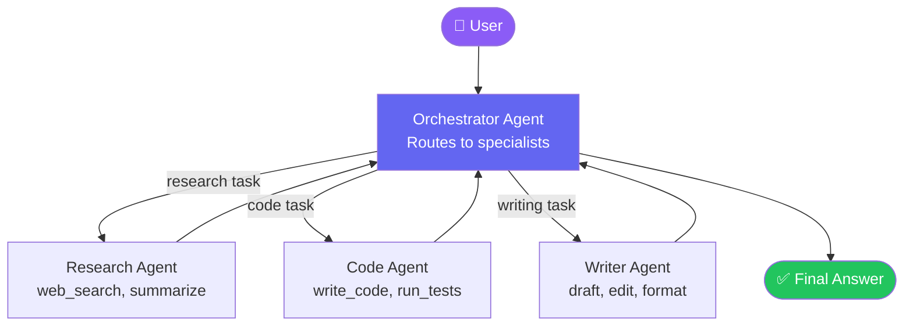
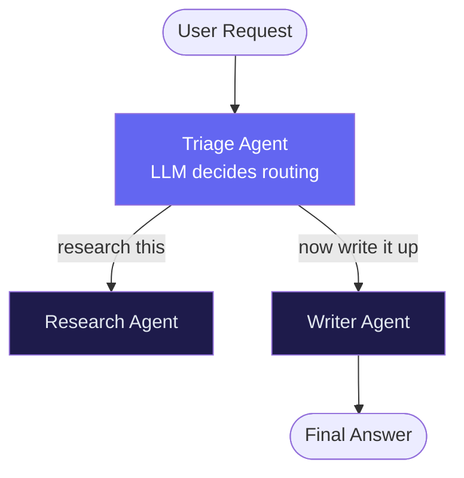

import FlashCardDeck from '@site/src/components/FlashCard';
import Quiz from '@site/src/components/Quiz';

# Multi-Agent Patterns

:::tip Learning Objectives — ⏱️ 40 min
- Understand why single agents have limits
- Build orchestrator/specialist pipelines
- Implement agent handoffs correctly
- Design parallel agent workflows for speed
:::

## Why Multiple Agents?

A single agent with 20 tools becomes confused — it doesn't know which tool to use, tries the wrong ones, and produces inconsistent results. Like asking one person to simultaneously be your lawyer, accountant, chef, and driver.

**The solution: specialized agents** that are experts in one domain, coordinated by an orchestrator that routes tasks to the right specialist.

Benefits:
- Each agent has a focused, clear purpose
- Smaller context = better performance per agent
- Specialists can use different models (GPT-4o for complex tasks, GPT-4o-mini for simple ones)
- Failures are isolated — one broken agent doesn't crash everything
- Teams can work on different agents independently

---

## Pattern 1 — Orchestrator / Specialist

The most common multi-agent pattern. An **orchestrator** receives user requests and **hands off** to specialist agents.



### Full Implementation

```python
import asyncio
from agents import Agent, Runner, handoff, function_tool

# ── Specialist Tools ──────────────────────────────────────────────────────────

@function_tool
async def search_web(query: str) -> str:
    """Search the internet for current information on any topic."""
    # Your search API call here
    return f"Search results for '{query}': [results...]"

@function_tool
def write_file(filename: str, content: str) -> str:
    """Write content to a file on disk."""
    with open(filename, "w") as f:
        f.write(content)
    return f"Written {len(content)} chars to {filename}"

@function_tool
def run_python(code: str) -> str:
    """Execute Python code and return the output."""
    import subprocess
    result = subprocess.run(["python3", "-c", code], capture_output=True, text=True)
    return result.stdout or result.stderr

# ── Specialist Agents ─────────────────────────────────────────────────────────

research_agent = Agent(
    name="Researcher",
    instructions="""
    You are a thorough research specialist.
    For every research request:
    1. Search for multiple relevant sources
    2. Cross-reference key facts
    3. Return a structured summary with bullet points
    Always cite sources.
    """,
    tools=[search_web],
    model="gpt-4o-mini",
)

code_agent = Agent(
    name="Software Engineer",
    instructions="""
    You are an expert Python developer.
    For coding tasks:
    1. Write clean, well-commented code
    2. Run the code to verify it works
    3. Fix any errors before returning
    Always include docstrings and type hints.
    """,
    tools=[write_file, run_python],
    model="gpt-4o",  # use more powerful model for complex code
)

writer_agent = Agent(
    name="Technical Writer",
    instructions="""
    You are a clear, engaging technical writer.
    - Use simple language for complex topics
    - Structure content with headers and bullet points
    - Always end with a practical takeaway
    """,
    tools=[],  # no tools needed — pure text generation
    model="gpt-4o-mini",
)

# ── Orchestrator ──────────────────────────────────────────────────────────────

orchestrator = Agent(
    name="Orchestrator",
    instructions="""
    You are a task router. Analyze requests and hand off to the right specialist:

    - Questions needing current information → Research Agent
    - Coding, debugging, scripting tasks → Software Engineer
    - Explanations, summaries, documentation → Technical Writer

    After receiving specialist output, combine and present it clearly to the user.
    Do NOT try to do specialist work yourself — always delegate.
    """,
    handoffs=[
        handoff(research_agent, tool_name_override="delegate_to_researcher"),
        handoff(code_agent, tool_name_override="delegate_to_engineer"),
        handoff(writer_agent, tool_name_override="delegate_to_writer"),
    ],
    model="gpt-4o-mini",
)

# ── Run the System ────────────────────────────────────────────────────────────

async def main():
    result = await Runner.run(
        orchestrator,
        "Write a Python script that fetches Bitcoin price and prints it."
    )
    print(result.final_output)
    # Orchestrator → delegates to code_agent → returns working script

asyncio.run(main())
```

---

## Pattern 2 — Sequential Pipeline

Each agent processes the output of the previous one — like an assembly line. Great for multi-stage tasks where order matters.

```
User Input → [Agent A: Extract] → [Agent B: Analyze] → [Agent C: Format] → Output
```

```python
async def run_pipeline(raw_text: str) -> str:
    """3-stage document processing pipeline."""

    # Stage 1: Extract key information
    extractor = Agent(
        name="Extractor",
        instructions="Extract all key facts, dates, names, and numbers from the text. Return as JSON.",
        model="gpt-4o-mini",
    )
    extracted = await Runner.run(extractor, f"Extract from:\n{raw_text}")

    # Stage 2: Analyze the extracted data
    analyzer = Agent(
        name="Analyzer",
        instructions="Analyze the extracted data. Identify trends, risks, and opportunities.",
        model="gpt-4o",  # more powerful for analysis
    )
    analysis = await Runner.run(analyzer, f"Analyze:\n{extracted.final_output}")

    # Stage 3: Format into a report
    formatter = Agent(
        name="Report Writer",
        instructions="Format the analysis into a professional executive summary with sections.",
        model="gpt-4o-mini",
    )
    report = await Runner.run(formatter, f"Format into report:\n{analysis.final_output}")

    return report.final_output
```

---

## Pattern 3 — Parallel Agents (For Speed)

Run multiple agents simultaneously and combine their results. Dramatically faster than sequential when tasks are independent.

```python
import asyncio

async def parallel_research(topic: str) -> str:
    """Research a topic from multiple angles simultaneously."""

    research_agent = Agent(
        name="Researcher",
        instructions="Research thoroughly using web search.",
        tools=[search_web],
        model="gpt-4o-mini",
    )

    # Launch all three research tasks AT THE SAME TIME
    results = await asyncio.gather(
        Runner.run(research_agent, f"What are the technical aspects of {topic}?"),
        Runner.run(research_agent, f"What are the business/market aspects of {topic}?"),
        Runner.run(research_agent, f"What are the risks and challenges of {topic}?"),
    )

    technical, business, risks = [r.final_output for r in results]

    # Combine with a synthesis agent
    synthesizer = Agent(
        name="Synthesizer",
        instructions="Combine multiple research reports into one comprehensive analysis.",
        model="gpt-4o",
    )

    combined = await Runner.run(
        synthesizer,
        f"Technical: {technical}\n\nBusiness: {business}\n\nRisks: {risks}"
    )

    return combined.final_output

# 3x faster than sequential!
# Sequential: 3 × 8 seconds = 24 seconds
# Parallel:   max(8, 8, 8) = 8 seconds
```

---

## Pattern 4 — Guardrails Agent

A safety agent that checks inputs/outputs before they reach the main agent. Critical for production.

```python
from agents import Agent, Runner, input_guardrail, GuardrailFunctionOutput
from pydantic import BaseModel

class SafetyCheck(BaseModel):
    is_safe: bool
    reason: str

@input_guardrail
async def safety_guardrail(ctx, agent, input_data):
    """Block harmful, off-topic, or malicious inputs."""
    safety_agent = Agent(
        name="Safety Checker",
        instructions="""
        Check if the user message is:
        1. Safe (no harmful content, no attempts to jailbreak)
        2. On-topic (related to AI agents and programming)

        Return JSON: {"is_safe": true/false, "reason": "explanation"}
        """,
        output_type=SafetyCheck,
        model="gpt-4o-mini",
    )

    result = await Runner.run(safety_agent, str(input_data))
    check = result.final_output

    return GuardrailFunctionOutput(
        output_info=check,
        tripwire_triggered=not check.is_safe,
    )

# Apply guardrail to your main agent
protected_agent = Agent(
    name="Course Tutor",
    instructions="Help students learn about AI agents.",
    input_guardrails=[safety_guardrail],
    model="gpt-4o-mini",
)
```

---

## Choosing the Right Pattern

<div style={{overflowX:"auto",margin:"20px 0"}}>
<table style={{width:"100%",borderCollapse:"collapse",fontSize:"0.88rem"}}>
  <thead>
    <tr style={{background:"#1e1b4b"}}>
      <th style={{padding:"10px 14px",color:"#a5b4fc",borderBottom:"1px solid #3730a3",textAlign:"left"}}>Pattern</th>
      <th style={{padding:"10px 14px",color:"#a5b4fc",borderBottom:"1px solid #3730a3",textAlign:"left"}}>Best For</th>
      <th style={{padding:"10px 14px",color:"#a5b4fc",borderBottom:"1px solid #3730a3",textAlign:"left"}}>Tradeoff</th>
    </tr>
  </thead>
  <tbody>
    {[
      ["Orchestrator/Specialist","Complex tasks needing different expertise","Higher latency (routing overhead)"],
      ["Sequential Pipeline","Multi-stage processing where output feeds next stage","Latency multiplies with stages"],
      ["Parallel","Independent tasks that can run simultaneously","Higher token cost (all run at once)"],
      ["Guardrails","Production apps needing safety/validation","Extra LLM call per request"],
    ].map(([p,b,t],i)=>(
      <tr key={i} style={{borderBottom:"1px solid #1e293b",background:i%2===0?"#0f0c1e":"#0a0818"}}>
        <td style={{padding:"10px 14px",color:"#e2e8f0",fontWeight:600}}>{p}</td>
        <td style={{padding:"10px 14px",color:"#94a3b8"}}>{b}</td>
        <td style={{padding:"10px 14px",color:"#f87171",fontSize:"0.82rem"}}>{t}</td>
      </tr>
    ))}
  </tbody>
</table>
</div>

---

## Official SDK: Two Orchestration Styles

From the [official OpenAI Agents SDK orchestration docs](https://openai.github.io/openai-agents-python/multi_agent/), there are two distinct ways to coordinate agents:

### 1. Orchestrating via LLM

An agent equipped with instructions, tools, and handoffs. The **LLM itself decides** which agents to call and in what order. Best for open-ended tasks where you want to rely on the model's reasoning.



Key tactics for LLM-driven orchestration:
- Invest heavily in agent instructions — be explicit about what tools are available
- Use specialized agents that excel at one task, not a general-purpose agent
- Monitor and iterate — run it, see where it fails, refine prompts
- Build evals to track improvement over time

### 2. Orchestrating via Code

**Your code** decides the flow — deterministic, predictable, and fast. Common patterns:

```python
import asyncio
from agents import Agent, Runner
from pydantic import BaseModel

# Pattern A: Classify with structured output, then branch
class Classification(BaseModel):
    category: str  # "billing" | "technical" | "general"

classifier = Agent(
    name="Classifier",
    instructions="Classify the user's query into one of: billing, technical, general",
    output_type=Classification,
)

billing_agent = Agent(name="Billing", instructions="Handle billing questions.")
tech_agent    = Agent(name="Tech Support", instructions="Handle technical issues.")

async def route_request(user_message: str):
    # Step 1: classify
    result = await Runner.run(classifier, user_message)
    category = result.final_output.category

    # Step 2: branch deterministically
    if category == "billing":
        return await Runner.run(billing_agent, user_message)
    elif category == "technical":
        return await Runner.run(tech_agent, user_message)
    else:
        return await Runner.run(general_agent, user_message)
```

```python
# Pattern B: Chain agents (output of one → input of next)
async def blog_pipeline(topic: str):
    outline  = await Runner.run(outline_agent,  f"Topic: {topic}")
    draft    = await Runner.run(writer_agent,   outline.final_output)
    polished = await Runner.run(editor_agent,   draft.final_output)
    return polished.final_output
```

```python
# Pattern C: Run agents in parallel for speed
async def parallel_research(query: str):
    results = await asyncio.gather(
        Runner.run(web_search_agent,  query),
        Runner.run(docs_search_agent, query),
        Runner.run(news_agent,        query),
    )
    # Combine all results
    combined = "\n\n".join(r.final_output for r in results)
    return await Runner.run(synthesizer_agent, combined)
```

### LLM-driven vs Code-driven: When to use which

| | LLM-driven | Code-driven |
|---|---|---|
| **Best for** | Open-ended tasks, complex routing logic | Predictable workflows, multi-stage pipelines |
| **Control** | LLM decides order | You decide order |
| **Performance** | Variable — depends on LLM quality | Predictable — follows your code |
| **Cost** | More LLM calls for routing decisions | Fewer calls — routing is free |
| **Debugging** | Harder — LLM can surprise you | Easy — standard Python debugging |

### Agents as Tools vs Handoffs

Both enable multi-agent collaboration, but they work differently:

| Pattern | How it works | Use when |
|---|---|---|
| **Agents as tools** | Manager agent keeps control; calls specialists via `Agent.as_tool()` | You want one agent to own the final answer; specialist is a helper |
| **Handoffs** | Triage agent routes to a specialist; specialist takes over the conversation | Specialist should respond directly; clean separation of concerns |

```python
# Agents as tools — manager stays in control
booking_agent = Agent(name="Booking Expert", ...)
refund_agent  = Agent(name="Refund Expert",  ...)

manager = Agent(
    name="Customer Service",
    instructions="Handle all user communication. Call specialists for help.",
    tools=[
        booking_agent.as_tool(
            tool_name="booking_expert",
            tool_description="Handles booking questions",
        ),
        refund_agent.as_tool(
            tool_name="refund_expert",
            tool_description="Handles refund questions",
        ),
    ],
)
```

```python
# Handoffs — triage hands over to specialist
triage = Agent(
    name="Triage",
    instructions=(
        "Route the user. "
        "Booking questions → booking_agent. "
        "Refund questions → refund_agent."
    ),
    handoffs=[booking_agent, refund_agent],
)
```

You can also **combine** the two: a triage agent hands off to a specialist, and that specialist can still call other agents as tools for narrow sub-tasks.

---

## 🃏 Flash Cards

<FlashCardDeck title="Multi-Agent Patterns" cards={[
  { question: "Why use multiple specialized agents instead of one agent with many tools?", answer: "Focused agents perform better than overloaded ones. Each agent has clear purpose, smaller context, can use the right model for its task, and failures are isolated." },
  { question: "What is the Orchestrator pattern?", answer: "An orchestrator agent receives user requests and routes them to specialist agents via handoffs. The orchestrator coordinates but doesn't do specialist work itself. Like a manager delegating to experts." },
  { question: "What is a handoff in the Agents SDK?", answer: "handoff(agent) creates a tool the orchestrator can call to transfer control to a specialist agent. The specialist runs and its output is returned to the user (or back to the orchestrator)." },
  { question: "When should you use parallel agents?", answer: "When tasks are independent and don't need each other's output. asyncio.gather() runs all agents simultaneously. 3 parallel agents take the same time as 1 — instead of 3x longer." },
  { question: "What is a Guardrails agent?", answer: "A safety/validation agent that checks inputs or outputs before they reach the main agent. Use @input_guardrail decorator. Critical for production to block harmful content, off-topic requests, or jailbreak attempts." },
  { question: "What is the Sequential Pipeline pattern best for?", answer: "Multi-stage processing where each stage needs the previous stage's output: Extract → Analyze → Format. Like an assembly line where order matters and each step builds on the last." },
]} />

---

## 📝 Quiz

<Quiz title="Multi-Agent Quiz" questions={[
  { question: "Why does an agent with 20 tools perform worse than multiple specialized agents?", options: ["Too many tools cost more tokens", "The agent gets confused about which tool to use, leading to inconsistent results", "The API has a limit of 10 tools", "More tools = slower inference"], correct: 1, explanation: "When an agent has too many tools for too many domains, it struggles to decide which to use. Specialized agents with 3-5 focused tools perform far more reliably." },
  { question: "What does asyncio.gather() do in the parallel pattern?", options: ["Runs agents one after another", "Runs multiple agents simultaneously and waits for all to complete", "Combines agent outputs automatically", "Limits API rate calls"], correct: 1, explanation: "asyncio.gather() launches all coroutines concurrently. 3 agents that each take 8 seconds will complete in ~8 seconds total instead of 24 seconds." },
  { question: "In the Orchestrator pattern, should the orchestrator do specialist work?", options: ["Yes, if it's a simple task", "No — it should always delegate to specialists via handoffs", "Only if no specialist is available", "Only for the first request"], correct: 1, explanation: "The orchestrator's job is routing and coordinating, not doing. If it starts doing specialist work, you lose the benefits of specialization and the pattern breaks down." },
  { question: "What is the main benefit of input guardrails?", options: ["They make responses faster", "They block harmful, off-topic or malicious inputs before reaching the main agent", "They reduce API costs", "They improve response formatting"], correct: 1, explanation: "Guardrails are a safety layer that runs before your main agent. They can block jailbreaks, harmful content, off-topic requests, or invalid inputs — essential for production." },
  { question: "When is a Sequential Pipeline better than Parallel agents?", options: ["When you want speed", "When each stage needs the previous stage's output as input", "When you have a budget constraint", "Always"], correct: 1, explanation: "Use sequential pipelines when tasks depend on each other: stage B needs stage A's output. Use parallel when tasks are independent. Forcing parallel on dependent tasks produces wrong results." },
]} />
