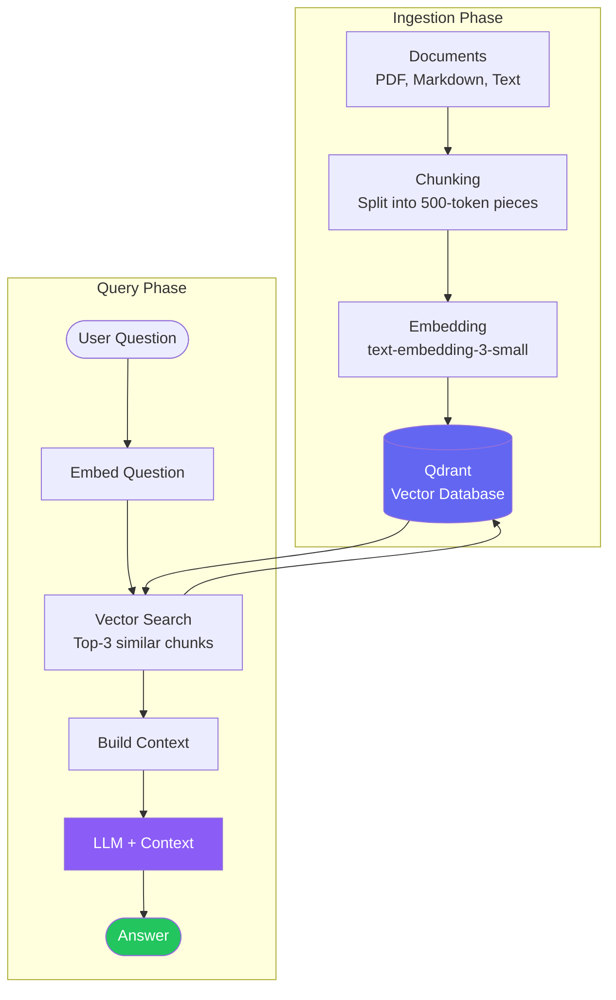

import FlashCardDeck from '@site/src/components/FlashCard';
import Quiz from '@site/src/components/Quiz';
import LessonComplete from '@site/src/components/LessonComplete';


# RAG Integration with Qdrant

:::tip Learning Objectives — ⏱️ 40 min
- Understand the RAG pipeline end-to-end
- Build a document ingestion system
- Create a RAG-powered agent tool
:::

## RAG Pipeline — Visual Overview

<div style={{margin:"24px 0",padding:"3px",background:"linear-gradient(135deg,#6366f1,#8b5cf6)",borderRadius:"16px"}}>
<div style={{background:"#080614",borderRadius:"14px",padding:"24px"}}>

**📥 Phase 1: Ingestion** — *Done once, offline*

<div style={{display:"flex",alignItems:"center",gap:"0",flexWrap:"wrap",margin:"12px 0 20px"}}>
  {[
    {icon:"📄",label:"Documents",sub:"PDF / MD / Text",c:"#6366f1"},
    {icon:"✂️",label:"Chunking",sub:"500 token pieces",c:"#7c3aed"},
    {icon:"🔢",label:"Embedding",sub:"text-embedding-3",c:"#8b5cf6"},
    {icon:"🗄️",label:"Qdrant DB",sub:"Vector storage",c:"#a855f7"},
  ].map((s,i,a)=>(
    <div key={i} style={{display:"flex",alignItems:"center"}}>
      <div style={{textAlign:"center",minWidth:"90px"}}>
        <div style={{fontSize:"1.6rem"}}>{s.icon}</div>
        <div style={{color:s.c,fontWeight:700,fontSize:"0.78rem"}}>{s.label}</div>
        <div style={{color:"#64748b",fontSize:"0.7rem"}}>{s.sub}</div>
      </div>
      {i<a.length-1&&<div style={{color:"#4338ca",fontSize:"1.3rem",margin:"0 4px",paddingBottom:"12px"}}>→</div>}
    </div>
  ))}
</div>

**🔍 Phase 2: Query** — *Happens on every user question*

<div style={{display:"flex",alignItems:"center",gap:"0",flexWrap:"wrap",margin:"12px 0"}}>
  {[
    {icon:"❓",label:"User Question",sub:"Natural language",c:"#38bdf8"},
    {icon:"🔢",label:"Embed Query",sub:"Same model",c:"#818cf8"},
    {icon:"🔎",label:"Vector Search",sub:"Top 3 chunks",c:"#a78bfa"},
    {icon:"🧠",label:"LLM + Context",sub:"GPT-4o-mini",c:"#c084fc"},
    {icon:"✅",label:"Answer",sub:"Grounded reply",c:"#34d399"},
  ].map((s,i,a)=>(
    <div key={i} style={{display:"flex",alignItems:"center"}}>
      <div style={{textAlign:"center",minWidth:"85px"}}>
        <div style={{fontSize:"1.6rem"}}>{s.icon}</div>
        <div style={{color:s.c,fontWeight:700,fontSize:"0.78rem"}}>{s.label}</div>
        <div style={{color:"#64748b",fontSize:"0.7rem"}}>{s.sub}</div>
      </div>
      {i<a.length-1&&<div style={{color:"#4338ca",fontSize:"1.3rem",margin:"0 4px",paddingBottom:"12px"}}>→</div>}
    </div>
  ))}
</div>

</div>
</div>

## RAG Pipeline — Detailed Flow



## Document Ingestion

```python
from qdrant_client import QdrantClient
from qdrant_client.models import Distance, VectorParams, PointStruct
from openai import OpenAI
import uuid

client = OpenAI()
qdrant = QdrantClient(url="...", api_key="...")

def create_collection(name: str):
    qdrant.create_collection(
        collection_name=name,
        vectors_config=VectorParams(size=1536, distance=Distance.COSINE),
    )

def ingest_document(collection: str, text: str, metadata: dict):
    # Split into chunks
    chunks = [text[i:i+500] for i in range(0, len(text), 400)]  # 100 overlap
    for chunk in chunks:
        embedding = client.embeddings.create(
            model="text-embedding-3-small", input=chunk
        ).data[0].embedding
        qdrant.upsert(collection_name=collection, points=[
            PointStruct(id=str(uuid.uuid4()), vector=embedding,
                        payload={**metadata, "content": chunk})
        ])
```

## RAG Tool for Agent

```python
from agents import function_tool

@function_tool
def search_knowledge_base(query: str) -> str:
    \"\"\"Search the course knowledge base for relevant information.\"\"\"
    embedding = client.embeddings.create(
        model="text-embedding-3-small", input=query
    ).data[0].embedding
    results = qdrant.search(
        collection_name="course-content",
        query_vector=embedding, limit=3
    )
    if not results:
        return "No relevant information found."
    return "\n\n---\n\n".join([r.payload.get("content", "") for r in results])
```

---

## 🃏 Flash Cards

<FlashCardDeck title="RAG Integration" cards={[
  { question: "What does RAG stand for?", answer: "Retrieval-Augmented Generation. It combines information retrieval (searching a database) with LLM generation — giving the LLM accurate, up-to-date knowledge it wasn't trained on." },
  { question: "What are the two phases of RAG?", answer: "1) Ingestion: chunk documents → embed them → store in vector DB. 2) Query: embed the question → search for similar chunks → provide them as context to the LLM." },
  { question: "Why chunk documents before embedding?", answer: "LLMs have context window limits. Chunking splits large documents into smaller pieces so they fit. It also improves search precision — you retrieve only the relevant section." },
  { question: "What embedding model is used in this course?", answer: "text-embedding-3-small from OpenAI. It produces 1536-dimensional vectors. It's fast, cheap, and excellent for semantic search tasks." },
  { question: "What is cosine similarity in vector search?", answer: "A measure of how 'similar' two vectors are in direction (0=unrelated, 1=identical meaning). Qdrant uses it to find the most semantically similar chunks to a query." },
]} />

---

## 📝 Quiz

<Quiz title="RAG Integration Quiz" questions={[
  { question: "Why is RAG better than just using a large context window?", options: ["RAG is cheaper and faster — you only retrieve the 3 most relevant chunks instead of sending 1000 pages to the LLM", "RAG doesn't need an LLM", "Large context windows don't exist yet", "RAG is more accurate because it's always wrong"], correct: 0, explanation: "Sending all documents every time is slow and expensive. RAG retrieves only the 2-3 most relevant chunks — reducing cost by 100x while improving focus." },
  { question: "What model converts text to vectors for storage in Qdrant?", options: ["gpt-4o-mini", "whisper-1", "text-embedding-3-small", "dall-e-3"], correct: 2, explanation: "text-embedding-3-small converts text to 1536-dimensional semantic vectors. These vectors represent meaning — similar texts get similar vectors." },
  { question: "What is 'chunking overlap' and why does it matter?", options: ["It means chunks share some text at their boundaries, preserving context that would otherwise be cut off", "It makes chunks larger", "It's a bug in the ingestion process", "Overlap reduces storage costs"], correct: 0, explanation: "If a sentence spans two chunks, each chunk gets part of it. Overlap (e.g., last 100 chars of chunk N = first 100 chars of chunk N+1) ensures no context is lost at boundaries." },
]} />

<LessonComplete lessonId="module-3/rag-integration" />
