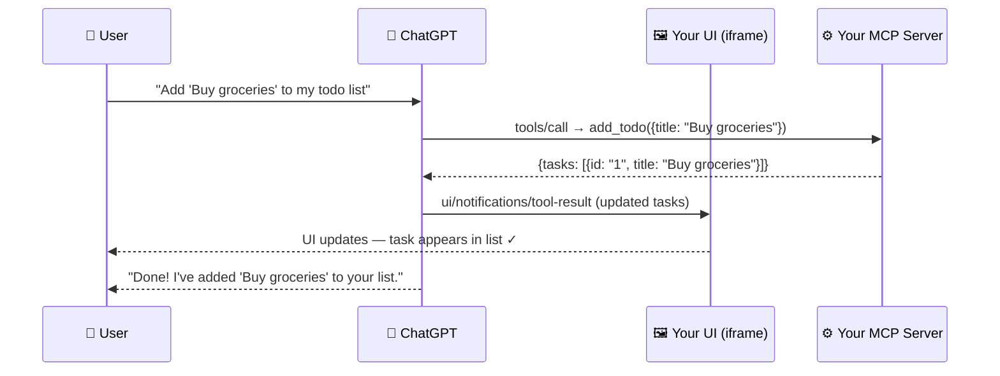

import FlashCardDeck from '@site/src/components/FlashCard';
import Quiz from '@site/src/components/Quiz';

# Publishing to ChatGPT Apps Store

:::tip Learning Objectives — ⏱️ 45 min
- Understand what the OpenAI Apps SDK is and how it differs from Custom GPTs
- Build an MCP server that ChatGPT can talk to
- Create a custom UI that renders inside ChatGPT
- Test locally using ngrok and MCP Inspector
- Submit your app to the ChatGPT Apps Store
:::

---

## Custom GPT vs ChatGPT Apps SDK — What's the Difference?

Before we build anything, let's clear up the most common confusion. These are **two completely different products** from OpenAI.

<div style={{margin:"24px 0",display:"grid",gridTemplateColumns:"1fr 1fr",gap:"16px",flexWrap:"wrap"}}>
  <div style={{background:"rgba(99,102,241,0.08)",border:"1px solid rgba(99,102,241,0.3)",borderRadius:"14px",padding:"20px"}}>
    <div style={{fontSize:"1.5rem",marginBottom:"8px"}}>🤖</div>
    <div style={{color:"#a5b4fc",fontWeight:700,fontSize:"0.9rem",marginBottom:"12px",textTransform:"uppercase",letterSpacing:"0.08em"}}>Custom GPT</div>
    <div style={{display:"flex",flexDirection:"column",gap:"6px"}}>
      {[
        "No coding required",
        "Built at chatgpt.com/create",
        "Just upload files + write instructions",
        "Limited to ChatGPT's chat interface",
        "No custom UI possible",
        "Published on GPT Store",
        "No backend server needed",
      ].map((s,i)=>(
        <div key={i} style={{color:"#94a3b8",fontSize:"0.82rem",display:"flex",gap:"8px"}}>
          <span style={{color:"#6366f1",flexShrink:0}}>•</span>{s}
        </div>
      ))}
    </div>
  </div>
  <div style={{background:"rgba(34,197,94,0.06)",border:"1px solid rgba(34,197,94,0.3)",borderRadius:"14px",padding:"20px"}}>
    <div style={{fontSize:"1.5rem",marginBottom:"8px"}}>🚀</div>
    <div style={{color:"#86efac",fontWeight:700,fontSize:"0.9rem",marginBottom:"12px",textTransform:"uppercase",letterSpacing:"0.08em"}}>Apps SDK (MCP App)</div>
    <div style={{display:"flex",flexDirection:"column",gap:"6px"}}>
      {[
        "Full coding required (Node.js / Python)",
        "You build your own MCP server",
        "Custom UI renders inside ChatGPT (iframe)",
        "Real tools that connect to your backend",
        "ChatGPT calls YOUR API",
        "Published on ChatGPT Apps Store",
        "Your server handles all logic & state",
      ].map((s,i)=>(
        <div key={i} style={{color:"#94a3b8",fontSize:"0.82rem",display:"flex",gap:"8px"}}>
          <span style={{color:"#22c55e",flexShrink:0}}>•</span>{s}
        </div>
      ))}
    </div>
  </div>
</div>

**Think of it this way:** A Custom GPT is like a pre-programmed vending machine inside ChatGPT. A ChatGPT App (Apps SDK) is like a full application that ChatGPT can interact with — with your own backend, your own UI, your own database, and real actions in the world.

---

## How ChatGPT Apps SDK Works

The entire system is built on **MCP (Model Context Protocol)** — an open standard that lets AI models talk to external tools and servers.



**The flow in plain English:**
1. User types a message in ChatGPT
2. ChatGPT calls a **tool** on your MCP server (e.g. `add_todo`)
3. Your server processes it and returns structured data
4. Your UI (running in an iframe) receives the update and re-renders
5. ChatGPT responds to the user with a confirmation

The magic is that ChatGPT **understands your tools** from their descriptions and automatically decides when to call them — just like it decides when to call a web search tool.

---

## What You'll Build

In this lesson, we'll build a **Todo List App** that runs inside ChatGPT. Users can say things like:
- *"Add 'Review PR #42' to my todo list"*
- *"Mark the first task as done"*
- *"Show me what's on my list"*

ChatGPT will automatically call the right tools, and your custom UI will update in real time.

<div style={{margin:"20px 0",padding:"3px",background:"linear-gradient(135deg,#6366f1,#22c55e)",borderRadius:"14px"}}>
<div style={{background:"#080614",borderRadius:"12px",padding:"20px"}}>

**What we'll create:**
- `public/todo-widget.html` — Your custom UI (renders inside ChatGPT)
- `server.js` — Your MCP server (Node.js)
- Two tools: `add_todo` and `complete_todo`

</div>
</div>

---

## Step 1 — Project Setup

Create a new folder and install dependencies:

```bash
mkdir chatgpt-todo-app && cd chatgpt-todo-app
mkdir public

# Install the MCP SDK, Apps SDK helpers, and Zod for validation
npm init -y
npm install @modelcontextprotocol/sdk @modelcontextprotocol/ext-apps zod
```

Add `"type": "module"` to your `package.json` (required for ES modules):

```json
{
  "name": "chatgpt-todo-app",
  "type": "module",
  "scripts": {
    "start": "node server.js"
  },
  "dependencies": {
    "@modelcontextprotocol/sdk": "^1.20.2",
    "@modelcontextprotocol/ext-apps": "^1.0.1",
    "zod": "^3.25.76"
  }
}
```

---

## Step 2 — Build the UI Component

Create `public/todo-widget.html`. This is the custom interface that will render **inside ChatGPT** in an iframe:

```html
<!DOCTYPE html>
<html lang="en">
  <head>
    <meta charset="utf-8" />
    <title>Todo list</title>
    <style>
      :root { color: #0b0b0f; font-family: "Inter", system-ui, sans-serif; }
      body { margin: 0; padding: 16px; background: #f6f8fb; }
      main {
        max-width: 360px; margin: 0 auto; background: #fff;
        border-radius: 16px; padding: 20px;
        box-shadow: 0 12px 24px rgba(15,23,42,0.08);
      }
      form { display: flex; gap: 8px; margin-bottom: 16px; }
      form input {
        flex: 1; padding: 10px 12px; border-radius: 10px;
        border: 1px solid #cad3e0; font-size: 0.95rem;
      }
      form button {
        border: none; border-radius: 10px; background: #111bf5;
        color: white; font-weight: 600; padding: 0 16px; cursor: pointer;
      }
      ul { list-style: none; padding: 0; margin: 0; display: flex; flex-direction: column; gap: 8px; }
      li {
        background: #f2f4fb; border-radius: 12px; padding: 10px 14px;
        display: flex; align-items: center; gap: 10px;
      }
      li[data-completed="true"] span { text-decoration: line-through; color: #6c768a; }
    </style>
  </head>
  <body>
    <main>
      <h2>Todo list</h2>
      <form id="add-form">
        <input id="todo-input" placeholder="Add a task" />
        <button type="submit">Add</button>
      </form>
      <ul id="todo-list"></ul>
    </main>

    <script type="module">
      const listEl = document.querySelector("#todo-list");
      const formEl = document.querySelector("#add-form");
      const inputEl = document.querySelector("#todo-input");
      let tasks = [];

      // ── Render tasks ──────────────────────────────────────────────────────
      const render = () => {
        listEl.innerHTML = "";
        tasks.forEach((task) => {
          const li = document.createElement("li");
          li.dataset.completed = String(Boolean(task.completed));
          const label = document.createElement("label");
          const checkbox = document.createElement("input");
          checkbox.type = "checkbox";
          checkbox.checked = Boolean(task.completed);
          const span = document.createElement("span");
          span.textContent = task.title;
          label.appendChild(checkbox);
          label.appendChild(span);
          li.appendChild(label);
          listEl.appendChild(li);
        });
      };

      // ── MCP Bridge (JSON-RPC over postMessage) ────────────────────────────
      // This is how your UI talks to ChatGPT's MCP runtime.
      // Every message follows the JSON-RPC 2.0 format.
      let rpcId = 0;
      const pendingRequests = new Map();

      const rpcRequest = (method, params) =>
        new Promise((resolve, reject) => {
          const id = ++rpcId;
          pendingRequests.set(id, { resolve, reject });
          window.parent.postMessage({ jsonrpc: "2.0", id, method, params }, "*");
        });

      const rpcNotify = (method, params) =>
        window.parent.postMessage({ jsonrpc: "2.0", method, params }, "*");

      window.addEventListener("message", (event) => {
        if (event.source !== window.parent) return;
        const msg = event.data;
        if (!msg || msg.jsonrpc !== "2.0") return;

        // Handle responses to our rpcRequest calls
        if (typeof msg.id === "number") {
          const pending = pendingRequests.get(msg.id);
          if (!pending) return;
          pendingRequests.delete(msg.id);
          if (msg.error) { pending.reject(msg.error); return; }
          pending.resolve(msg.result);
          return;
        }

        // Handle notifications FROM ChatGPT (e.g. when model calls a tool)
        if (msg.method === "ui/notifications/tool-result") {
          if (msg.params?.structuredContent?.tasks) {
            tasks = msg.params.structuredContent.tasks;
            render();
          }
        }
      });

      // ── Initialize bridge when page loads ────────────────────────────────
      const initBridge = async () => {
        await rpcRequest("ui/initialize", {
          appInfo: { name: "todo-widget", version: "0.1.0" },
          appCapabilities: {},
          protocolVersion: "2026-01-26",
        });
        rpcNotify("ui/notifications/initialized", {});
      };
      const bridgeReady = initBridge();

      // ── Call a tool on your MCP server ────────────────────────────────────
      const callTool = async (name, args) => {
        await bridgeReady;
        const response = await rpcRequest("tools/call", { name, arguments: args });
        if (response?.structuredContent?.tasks) {
          tasks = response.structuredContent.tasks;
          render();
        }
      };

      // ── Handle form submit ────────────────────────────────────────────────
      formEl.addEventListener("submit", async (e) => {
        e.preventDefault();
        const title = inputEl.value.trim();
        if (!title) return;
        await callTool("add_todo", { title });
        inputEl.value = "";
      });

      // ── Handle checkbox (complete todo) ──────────────────────────────────
      listEl.addEventListener("change", async (e) => {
        const checkbox = e.target;
        if (!checkbox.matches('input[type="checkbox"]')) return;
        const id = checkbox.closest("li")?.dataset.id;
        if (id) await callTool("complete_todo", { id });
      });

      render();
    </script>
  </body>
</html>
```

:::info Key Concept — The MCP Bridge
The UI communicates with ChatGPT via **JSON-RPC over `postMessage`**. Think of it as a phone line between your iframe and the ChatGPT parent window. Three important messages:
- `ui/initialize` → Tell ChatGPT "I'm ready"
- `tools/call` → Call a tool on your MCP server from the UI
- `ui/notifications/tool-result` → ChatGPT tells the UI when a tool result arrives (so you can update the UI)
:::

---

## Step 3 — Build the MCP Server

Create `server.js`. This is the backend that ChatGPT actually talks to:

```javascript
import { createServer } from "node:http";
import { readFileSync } from "node:fs";
import {
  registerAppResource,
  registerAppTool,
  RESOURCE_MIME_TYPE,
} from "@modelcontextprotocol/ext-apps/server";
import { McpServer } from "@modelcontextprotocol/sdk/server/mcp.js";
import { StreamableHTTPServerTransport } from "@modelcontextprotocol/sdk/server/streamableHttp.js";
import { z } from "zod";

// ── Load the HTML widget ─────────────────────────────────────────────────────
const todoHtml = readFileSync("public/todo-widget.html", "utf8");

// ── In-memory state (use a database in production!) ─────────────────────────
let todos = [];
let nextId = 1;

// Helper: always return the current task list as structured content
const replyWithTodos = (message) => ({
  content: message ? [{ type: "text", text: message }] : [],
  structuredContent: { tasks: todos },   // ← This updates the UI
});

// ── Create the MCP server ────────────────────────────────────────────────────
function createTodoServer() {
  const server = new McpServer({ name: "todo-app", version: "0.1.0" });

  // Register your HTML widget as a resource ChatGPT can render
  registerAppResource(
    server,
    "todo-widget",
    "ui://widget/todo.html",
    {},
    async () => ({
      contents: [{
        uri: "ui://widget/todo.html",
        mimeType: RESOURCE_MIME_TYPE,
        text: todoHtml,
      }],
    })
  );

  // ── Tool 1: Add a todo ───────────────────────────────────────────────────
  // ChatGPT will call this when user says "add X to my list"
  registerAppTool(
    server,
    "add_todo",
    {
      title: "Add todo",
      description: "Creates a todo item with the given title.",
      inputSchema: { title: z.string().min(1) },
      _meta: { ui: { resourceUri: "ui://widget/todo.html" } },
    },
    async ({ title }) => {
      const todo = { id: `todo-${nextId++}`, title: title.trim(), completed: false };
      todos = [...todos, todo];
      return replyWithTodos(`Added "${todo.title}".`);
    }
  );

  // ── Tool 2: Complete a todo ──────────────────────────────────────────────
  // ChatGPT will call this when user says "mark X as done"
  registerAppTool(
    server,
    "complete_todo",
    {
      title: "Complete todo",
      description: "Marks a todo as done by its id.",
      inputSchema: { id: z.string().min(1) },
      _meta: { ui: { resourceUri: "ui://widget/todo.html" } },
    },
    async ({ id }) => {
      todos = todos.map((t) => t.id === id ? { ...t, completed: true } : t);
      return replyWithTodos(`Done!`);
    }
  );

  return server;
}

// ── HTTP Server (handles MCP requests at /mcp) ───────────────────────────────
const port = Number(process.env.PORT ?? 8787);

createServer(async (req, res) => {
  const url = new URL(req.url, `http://${req.headers.host}`);

  // CORS preflight
  if (req.method === "OPTIONS" && url.pathname === "/mcp") {
    res.writeHead(204, {
      "Access-Control-Allow-Origin": "*",
      "Access-Control-Allow-Methods": "POST, GET, OPTIONS",
      "Access-Control-Allow-Headers": "content-type, mcp-session-id",
    });
    return res.end();
  }

  // Health check
  if (req.method === "GET" && url.pathname === "/") {
    return res.writeHead(200).end("Todo MCP server running ✓");
  }

  // MCP endpoint — ChatGPT calls this
  if (url.pathname === "/mcp") {
    res.setHeader("Access-Control-Allow-Origin", "*");
    const server = createTodoServer();
    const transport = new StreamableHTTPServerTransport({
      sessionIdGenerator: undefined,   // stateless — fine for simple apps
      enableJsonResponse: true,
    });
    res.on("close", () => { transport.close(); server.close(); });
    await server.connect(transport);
    await transport.handleRequest(req, res);
    return;
  }

  res.writeHead(404).end("Not Found");
}).listen(port, () => {
  console.log(`✓ MCP server running at http://localhost:${port}/mcp`);
});
```

---

## Step 4 — Run and Test Locally

**Start your server:**
```bash
node server.js
# ✓ MCP server running at http://localhost:8787/mcp
```

**Test with MCP Inspector** (optional but useful):
```bash
npx @modelcontextprotocol/inspector@latest \
  --server-url http://localhost:8787/mcp \
  --transport http
```

This opens a browser UI where you can manually call your tools and see responses before connecting to ChatGPT.

---

## Step 5 — Expose to the Internet with ngrok

ChatGPT can't reach `localhost` — it needs a public HTTPS URL. Use **ngrok** to create a tunnel:

```bash
# Install ngrok from https://ngrok.com if you haven't
ngrok http 8787
```

ngrok gives you a URL like: `https://abc123.ngrok.app`

Your MCP endpoint is now: `https://abc123.ngrok.app/mcp` ← this is what you'll give to ChatGPT.

:::caution ngrok URL changes every restart
The free ngrok URL changes every time you restart it. For persistent development, use a fixed domain (paid ngrok) or deploy to Cloud Run (see the Deployment lesson).
:::

---

## Step 6 — Connect to ChatGPT

1. Open **ChatGPT** → Settings (gear icon)
2. Go to **Apps & Connectors → Advanced settings**
3. Enable **Developer Mode**

<div style={{margin:"16px 0",background:"rgba(99,102,241,0.08)",border:"1px solid rgba(99,102,241,0.2)",borderRadius:"12px",padding:"16px"}}>
  <div style={{color:"#a5b4fc",fontWeight:700,fontSize:"0.85rem",marginBottom:"8px"}}>📍 Settings path:</div>
  <div style={{color:"#94a3b8",fontSize:"0.85rem"}}>Settings → Apps & Connectors → Advanced settings → Developer Mode ✓</div>
</div>

4. Go to **Settings → Connectors → Create**
5. Paste your ngrok URL with `/mcp`: `https://abc123.ngrok.app/mcp`
6. Give it a name: "My Todo App"
7. Click **Create**

Now open a new chat, click the **+** button → **More** → select your connector. Then try:
- *"Add 'Read chapter 3' to my todo list"*
- *"Add 'Review pull request' and 'Write tests' as tasks"*
- *"Mark the first task as done"*

Your custom UI will appear inside ChatGPT and update in real time! 🎉

---

## Step 7 — Submit to ChatGPT Apps Store

When your app is ready for the public:

<div style={{margin:"24px 0",display:"flex",flexDirection:"column",gap:"12px"}}>
  {[
    {step:"1",title:"Review Guidelines",desc:"Read the App Submission Guidelines at developers.openai.com/apps-sdk/app-submission-guidelines — OpenAI checks for quality, safety, and policy compliance.",color:"#6366f1"},
    {step:"2",title:"Deploy Your Server",desc:"Deploy your MCP server to a production URL (Cloud Run, Railway, Render). It must be a permanent HTTPS URL — not ngrok.",color:"#8b5cf6"},
    {step:"3",title:"Optimize Metadata",desc:"Write clear tool descriptions. ChatGPT uses these to decide when to call your tools. Bad descriptions = tools never used.",color:"#a855f7"},
    {step:"4",title:"Submit for Review",desc:"Go to platform.openai.com → Apps → Submit. OpenAI reviews your app (usually 5-10 business days).",color:"#c084fc"},
    {step:"5",title:"Published!",desc:"Approved apps appear in the ChatGPT Apps Store. Any ChatGPT Plus user can install and use your app.",color:"#22c55e"},
  ].map((item,i)=>(
    <div key={i} style={{display:"flex",gap:"14px",alignItems:"flex-start"}}>
      <div style={{
        width:"32px",height:"32px",borderRadius:"50%",flexShrink:0,
        background:`${item.color}22`,border:`2px solid ${item.color}`,
        display:"flex",alignItems:"center",justifyContent:"center",
        color:item.color,fontWeight:700,fontSize:"0.85rem",
      }}>{item.step}</div>
      <div>
        <div style={{color:"#e2e8f0",fontWeight:700,fontSize:"0.88rem",marginBottom:"3px"}}>{item.title}</div>
        <div style={{color:"#64748b",fontSize:"0.82rem",lineHeight:1.5}}>{item.desc}</div>
      </div>
    </div>
  ))}
</div>

---

## What Makes a Great ChatGPT App?

According to OpenAI's guidelines, the best apps:

<div style={{margin:"20px 0",display:"grid",gridTemplateColumns:"repeat(auto-fit,minmax(200px,1fr))",gap:"12px"}}>
  {[
    {icon:"🎯",title:"Solves a Real Problem",desc:"Not just a demo — users need to return to it regularly.",color:"#6366f1"},
    {icon:"📝",title:"Clear Tool Descriptions",desc:"ChatGPT reads these to know when to call your tools. Be specific.",color:"#8b5cf6"},
    {icon:"⚡",title:"Fast Response Time",desc:"Tools should respond in under 2 seconds. Users won't wait.",color:"#a855f7"},
    {icon:"🔄",title:"Stateful UI",desc:"Your UI should reflect the current state — no stale data.",color:"#c084fc"},
    {icon:"🔒",title:"Privacy-First",desc:"Only store what you need. Users trust ChatGPT — don't break that.",color:"#818cf8"},
  ].map((item,i)=>(
    <div key={i} style={{background:item.color+"11",border:`1px solid ${item.color}33`,borderRadius:"12px",padding:"14px"}}>
      <div style={{fontSize:"1.3rem",marginBottom:"6px"}}>{item.icon}</div>
      <div style={{color:item.color,fontWeight:700,fontSize:"0.82rem",marginBottom:"4px"}}>{item.title}</div>
      <div style={{color:"#64748b",fontSize:"0.78rem",lineHeight:1.5}}>{item.desc}</div>
    </div>
  ))}
</div>

---

## Real-World App Ideas Using This Stack

Now that you know how to build ChatGPT Apps, here are ideas you could build combining everything from this course:

| App Idea | Tools | Your AI Agent Inside |
|---|---|---|
| **Study Flashcard App** | `create_card`, `quiz_me`, `show_progress` | RAG agent pulls from your course notes |
| **Customer Support** | `lookup_order`, `create_ticket`, `escalate` | Support agent from Module 4 |
| **Code Review App** | `submit_pr`, `get_feedback`, `approve` | Code analysis agent |
| **Research Assistant** | `search`, `summarize`, `save_note` | Research agent from Module 4 |
| **Invoice Manager** | `create_invoice`, `send_email`, `track_payment` | Multi-agent orchestrator |

---

## 🃏 Flash Cards

<FlashCardDeck title="ChatGPT Apps SDK" cards={[
  {
    question: "What is the difference between a Custom GPT and a ChatGPT App (Apps SDK)?",
    answer: "Custom GPT: no-code, just instructions + files, limited to chat, published on GPT Store. ChatGPT App (Apps SDK): full code, your own MCP server + custom UI inside ChatGPT, can connect to any database/API, published on ChatGPT Apps Store."
  },
  {
    question: "What protocol does the Apps SDK use to connect ChatGPT to your server?",
    answer: "MCP — Model Context Protocol. It's an open standard (not proprietary to OpenAI) that lets AI models talk to external tools and servers. Your server exposes tools at a /mcp HTTP endpoint and ChatGPT calls them."
  },
  {
    question: "What are the two things you need to build a ChatGPT App?",
    answer: "1) An MCP Server (required) — exposes tools that ChatGPT can call (e.g. add_todo, complete_todo). 2) A Web Component/UI (optional) — an HTML/React widget rendered in an iframe inside ChatGPT that updates when tools are called."
  },
  {
    question: "How does your UI communicate with ChatGPT?",
    answer: "Via JSON-RPC 2.0 over postMessage (the MCP Apps bridge). Your UI sends messages like ui/initialize and tools/call to the parent ChatGPT window. ChatGPT sends back ui/notifications/tool-result when a tool completes."
  },
  {
    question: "Why do you need ngrok for local development?",
    answer: "ChatGPT runs in OpenAI's servers in the cloud — it can't reach your localhost. ngrok creates a public HTTPS tunnel from the internet to your local machine. You give ChatGPT the ngrok URL and it forwards requests to your local server."
  },
  {
    question: "What does structuredContent in a tool response do?",
    answer: "It passes machine-readable data back to your UI. When your tool returns { structuredContent: { tasks: [...] } }, ChatGPT forwards this to your UI via ui/notifications/tool-result, and your UI can use it to re-render the component with fresh data."
  },
]} />

---

## 📝 Quiz

<Quiz title="ChatGPT Apps SDK Quiz" questions={[
  {
    question: "A student wants to build an app that lets ChatGPT users book restaurant reservations with a custom calendar UI. Which should they use?",
    options: [
      "Custom GPT — it's simpler and no coding needed",
      "Apps SDK — they need a custom UI, real booking API calls, and their own database",
      "OpenAI Assistants API — it supports file uploads",
      "DALL-E — to generate menu images"
    ],
    correct: 1,
    explanation: "Custom GPT can't render custom UIs or connect to custom databases. The Apps SDK lets you build a custom calendar interface (in an iframe) and connect to a real booking system via your MCP server tools."
  },
  {
    question: "Your MCP tool returns { structuredContent: { tasks: [...] } }. What happens in the ChatGPT UI?",
    options: [
      "ChatGPT reads the tasks aloud to the user",
      "ChatGPT forwards this data to your iframe via ui/notifications/tool-result so your UI can re-render",
      "The data is saved to OpenAI's database automatically",
      "Nothing — structuredContent is only for logging"
    ],
    correct: 1,
    explanation: "structuredContent is the mechanism for passing structured data from your server to your UI widget. ChatGPT acts as a relay — it forwards the tool result to your iframe so you can update the displayed state in real time."
  },
  {
    question: "You deploy your MCP server and submit to the Apps Store, but ChatGPT never calls your tools. What is the most likely cause?",
    options: [
      "The server is too slow",
      "Your tool descriptions are unclear — ChatGPT reads descriptions to decide when to call tools. Vague descriptions mean tools never trigger",
      "You need to use Python, not Node.js",
      "The Apps Store requires a paid OpenAI account"
    ],
    correct: 1,
    explanation: "Tool descriptions are critical. ChatGPT uses them (like a system prompt) to decide when each tool is appropriate. 'A tool that does things' will never be called. 'Creates a new todo item with the given title string' is clear and will be called correctly."
  },
  {
    question: "What is ngrok used for in ChatGPT App development?",
    options: [
      "To minify JavaScript for faster loading",
      "To create a public HTTPS tunnel so ChatGPT (running in OpenAI's cloud) can reach your local development server",
      "To generate MCP server boilerplate code",
      "To deploy your app to the ChatGPT Apps Store"
    ],
    correct: 1,
    explanation: "ChatGPT can't reach localhost — it runs in OpenAI's cloud. ngrok creates a public URL (e.g. https://abc123.ngrok.app/mcp) that tunnels to your local port 8787, letting ChatGPT call your MCP server during development."
  },
]} />
