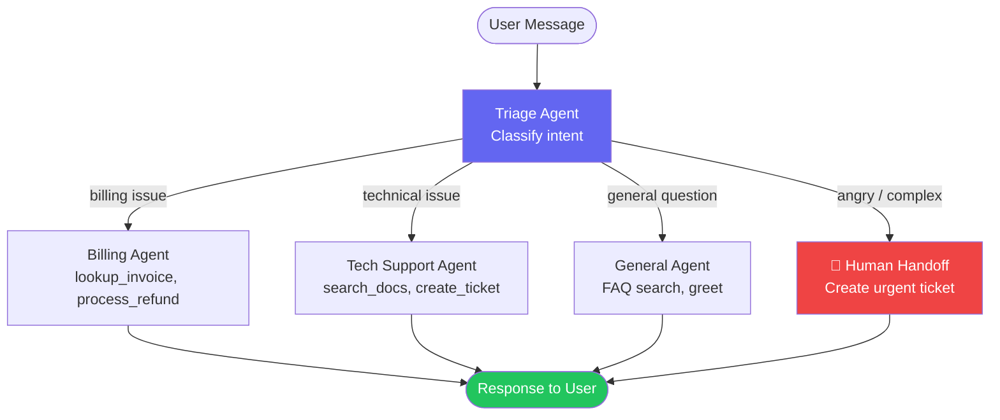

import FlashCardDeck from '@site/src/components/FlashCard';
import Quiz from '@site/src/components/Quiz';
import LessonComplete from '@site/src/components/LessonComplete';

# Customer Support Agent

:::tip Learning Objectives — ⏱️ 45 min
- Build a complete production-ready support system
- Implement multi-tier routing (billing, technical, general)
- Add escalation logic with human handoff
- Handle guardrails and edge cases
:::

## What We're Building

A real customer support agent that can:
- **Triage** incoming messages (billing? technical? general?)
- **Route** to the right specialist
- **Escalate** to a human when needed
- **Track** conversation context
- **Handle** angry customers gracefully

This is a system you could actually deploy for a SaaS product.

---

## Architecture



---

## Step 1 — Define the Data Models

```python
from dataclasses import dataclass, field
from pydantic import BaseModel
from typing import Literal

@dataclass
class CustomerContext:
    """Working memory for a support session."""
    user_id: str
    user_name: str
    email: str
    plan: Literal["free", "pro", "enterprise"] = "free"
    open_tickets: list[str] = field(default_factory=list)
    sentiment: Literal["positive", "neutral", "frustrated", "angry"] = "neutral"
    issue_category: str = ""
    escalated: bool = False

class TriageResult(BaseModel):
    """Structured output from the triage agent."""
    category: Literal["billing", "technical", "general", "escalate"]
    urgency: Literal["low", "medium", "high", "critical"]
    summary: str
    sentiment: Literal["positive", "neutral", "frustrated", "angry"]
```

---

## Step 2 — Build the Tools

```python
from agents import function_tool, RunContextWrapper
import sqlite3
from datetime import datetime

@function_tool
def lookup_invoice(
    wrapper: RunContextWrapper[CustomerContext],
    invoice_id: str
) -> str:
    """Look up details of a specific invoice by ID."""
    ctx = wrapper.context
    # In production: query your billing system (Stripe, etc.)
    return f"""
    Invoice #{invoice_id}
    Customer: {ctx.user_name}
    Amount: $49.00
    Date: 2024-02-15
    Status: Paid
    Plan: {ctx.plan}
    """

@function_tool
def process_refund(
    wrapper: RunContextWrapper[CustomerContext],
    invoice_id: str,
    reason: str
) -> str:
    """Process a refund for a specific invoice. Only for valid billing issues."""
    ctx = wrapper.context
    # In production: call Stripe refund API
    if ctx.plan == "free":
        return "Error: Free plan users have no paid invoices to refund."

    # Log the refund
    print(f"💰 Processing refund: Invoice {invoice_id} for {ctx.user_name}. Reason: {reason}")
    return f"Refund initiated for invoice #{invoice_id}. Amount will appear in 3-5 business days."

@function_tool
def search_help_docs(query: str) -> str:
    """Search the help documentation for answers to technical questions."""
    # In production: search your docs with vector search
    docs = {
        "api key": "API keys can be found in Settings > API Keys. Each key has a prefix 'sk-'.",
        "rate limit": "Free plans: 100 req/day. Pro: 10,000 req/day. Enterprise: unlimited.",
        "webhook": "Webhooks can be configured at Settings > Integrations > Webhooks.",
        "password": "Reset your password at /forgot-password. Check spam if no email.",
    }
    for keyword, doc in docs.items():
        if keyword in query.lower():
            return doc
    return f"No documentation found for '{query}'. Creating a support ticket."

@function_tool
def create_support_ticket(
    wrapper: RunContextWrapper[CustomerContext],
    subject: str,
    description: str,
    priority: str = "medium"
) -> str:
    """Create a support ticket in the ticketing system."""
    ctx = wrapper.context
    ticket_id = f"TKT-{datetime.now().strftime('%Y%m%d%H%M%S')}"
    ctx.open_tickets.append(ticket_id)

    print(f"🎫 Created ticket {ticket_id}: {subject} [{priority}]")
    return f"Support ticket {ticket_id} created. Our team will respond within 24 hours (Pro plan)."

@function_tool
def escalate_to_human(
    wrapper: RunContextWrapper[CustomerContext],
    reason: str
) -> str:
    """Escalate this conversation to a human support agent immediately."""
    ctx = wrapper.context
    ctx.escalated = True
    ctx.sentiment = "frustrated"

    urgency = "URGENT" if ctx.plan == "enterprise" else "HIGH"
    print(f"🚨 [{urgency}] Escalating {ctx.user_name} to human: {reason}")

    if ctx.plan == "enterprise":
        return "I'm connecting you with a dedicated Enterprise support engineer right now. Average wait: 2 minutes."
    else:
        return "I'm escalating this to our support team. You'll receive an email within 2 hours with a response from a human agent."
```

---

## Step 3 — Build the Specialist Agents

```python
from agents import Agent

billing_agent = Agent(
    name="Billing Specialist",
    instructions="""
    You are a billing support specialist. You handle:
    - Invoice questions and disputes
    - Subscription changes and upgrades
    - Refund requests (only valid ones)
    - Payment method issues

    Rules:
    - Always look up the invoice before discussing it
    - Only process refunds for invoices within the last 30 days
    - Be empathetic — billing issues cause real stress
    - If you cannot resolve the issue, escalate to human

    Tone: Professional, understanding, solution-focused.
    """,
    tools=[lookup_invoice, process_refund, escalate_to_human],
    model="gpt-4o-mini",
)

tech_agent = Agent(
    name="Technical Support Specialist",
    instructions="""
    You are a technical support specialist. You help with:
    - API integration issues
    - Configuration problems
    - Bug reports and workarounds
    - Feature questions

    Process:
    1. Search the help docs first
    2. Provide clear step-by-step solution
    3. If unsolved, create a support ticket
    4. For critical bugs, escalate immediately

    Always ask for error messages and steps to reproduce.
    """,
    tools=[search_help_docs, create_support_ticket, escalate_to_human],
    model="gpt-4o-mini",
)

general_agent = Agent(
    name="General Support",
    instructions="""
    You handle general questions and greetings.
    - Answer product questions from your knowledge
    - Help with account navigation
    - Route to billing/tech agents when needed
    - Keep responses friendly and concise

    If the user seems frustrated, escalate proactively — don't let them boil over.
    """,
    tools=[escalate_to_human],
    model="gpt-4o-mini",
)
```

---

## Step 4 — The Triage Orchestrator

```python
from agents import handoff

triage_agent = Agent(
    name="Triage Agent",
    instructions="""
    You are a customer support triage agent. Your ONLY job is to:
    1. Read the customer's message carefully
    2. Detect their sentiment (positive/neutral/frustrated/angry)
    3. Route to the correct specialist IMMEDIATELY — do not try to solve it yourself

    Routing rules:
    - Invoice, payment, refund, subscription → Billing Specialist
    - API error, bug, configuration, integration → Tech Support
    - Angry/frustrated OR complex multi-issue → Human Escalation
    - Everything else → General Support

    Enterprise plan users ALWAYS get priority escalation if they express any frustration.
    Do not make the customer repeat themselves after routing.
    """,
    handoffs=[
        handoff(billing_agent, tool_name_override="route_to_billing"),
        handoff(tech_agent, tool_name_override="route_to_tech_support"),
        handoff(general_agent, tool_name_override="route_to_general"),
    ],
    model="gpt-4o-mini",
)
```

---

## Step 5 — Run the System

```python
import asyncio
from agents import Runner

async def handle_message(user_id: str, message: str):
    # Load customer data (from your database in production)
    ctx = CustomerContext(
        user_id=user_id,
        user_name="Ahmed Khan",
        email="ahmed@example.com",
        plan="pro",
    )

    result = await Runner.run(
        triage_agent,
        message,
        context=ctx,
    )

    # Check outcomes
    if ctx.escalated:
        print(f"\n⚠️  Session escalated to human for: {ctx.user_name}")

    return result.final_output

async def main():
    # Test different scenarios
    tests = [
        "Hi, I was charged twice for my subscription this month. Invoice #1234",
        "My API keeps returning 429 errors even though I'm on the Pro plan",
        "I'm absolutely furious! This is the 3rd time this has happened!",
        "What's the difference between Pro and Enterprise plans?",
    ]

    for msg in tests:
        print(f"\n{'='*60}")
        print(f"User: {msg}")
        print(f"Agent: {await handle_message('user_123', msg)}")

asyncio.run(main())
```

---

## Expected Output

```
============================================================
User: Hi, I was charged twice for my subscription this month. Invoice #1234
Agent: I'm sorry to hear about the double charge, Ahmed. I've looked up 
invoice #1234 — it shows $49.00 paid on Feb 15. I can see there may be 
a duplicate. I've initiated a refund for the duplicate charge. You'll see 
it in 3-5 business days.

============================================================
User: My API keeps returning 429 errors even though I'm on the Pro plan
Agent: I understand how frustrating rate limit errors can be. According to 
our docs, Pro plans allow 10,000 requests/day. A 429 error usually means 
you've hit this limit. I've created ticket TKT-20240315... 

============================================================
User: I'm absolutely furious! This is the 3rd time this has happened!
🚨 [HIGH] Escalating Ahmed Khan to human
Agent: I'm so sorry you're going through this again — this is completely 
unacceptable. I'm escalating you to our support team right now. You'll 
receive a personal response within 2 hours.
```

---

## 🃏 Flash Cards

<FlashCardDeck title="Customer Support Agent" cards={[
  { question: "What is the Triage Agent's job?", answer: "ONLY to classify and route — not to solve. It reads the message, detects sentiment, and immediately routes to the correct specialist via handoffs. It never tries to answer billing or technical questions itself." },
  { question: "Why use a Context object for support sessions?", answer: "It carries structured customer data (plan, sentiment, tickets) across all agents in the pipeline. Tools can read the plan tier to adjust responses, and write back escalation flags." },
  { question: "What triggers escalation to a human?", answer: "Angry/frustrated sentiment, complex multi-issue problems, repeated complaints, or any frustration from Enterprise tier customers. Always better to escalate early than let the customer leave angry." },
  { question: "Why do tools accept RunContextWrapper instead of direct args?", answer: "RunContextWrapper gives access to the CustomerContext object. Tools can read user data (plan, name) and write back to context (flag escalation, add ticket IDs) without global state." },
  { question: "Why use different models for different agents?", answer: "Triage and general queries → gpt-4o-mini (fast, cheap). Complex technical analysis or code → gpt-4o (more accurate). Match model power to task complexity to balance cost and quality." },
]} />

---

## 📝 Quiz

<Quiz title="Support Agent Quiz" questions={[
  { question: "Why should the Triage Agent NOT try to answer questions itself?", options: ["It's too expensive", "Triage agents should only classify and route — answering breaks separation of concerns and leads to inconsistent responses", "It doesn't have the right model", "Users prefer specialists"], correct: 1, explanation: "The Triage agent's value is accurate routing. If it starts answering billing and technical questions, it becomes an overloaded jack-of-all-trades that performs worse than specialized agents." },
  { question: "What information does CustomerContext carry?", options: ["Only the user's messages", "Structured data: user ID, name, plan, sentiment, tickets, escalation flag — shared across all agents", "Just the API key", "Only the conversation history"], correct: 1, explanation: "CustomerContext is working memory for the session. It carries everything agents need: user profile, detected sentiment, created tickets, and whether escalation was triggered." },
  { question: "What is the right response to an 'angry' sentiment detection?", options: ["Ignore it and answer the question", "Immediately escalate to a human agent before the customer gets more frustrated", "Ask them to calm down", "Offer a discount automatically"], correct: 1, explanation: "Early escalation is better than late escalation. An already-angry customer who has to repeat themselves to a human will be even angrier. Escalate proactively at the first sign of real frustration." },
  { question: "Why should refund tools check the customer's plan?", options: ["Free users get bigger refunds", "Free plan users have no paid invoices — attempting a refund would fail or cause errors", "Pro users can't get refunds", "All plans get the same treatment"], correct: 1, explanation: "Checking the plan before attempting a refund prevents errors and provides a better user experience. Free users should be told they have no paid invoices, not get a confusing error message." },
]} />

<LessonComplete lessonId="module-4/customer-support-agent" />
