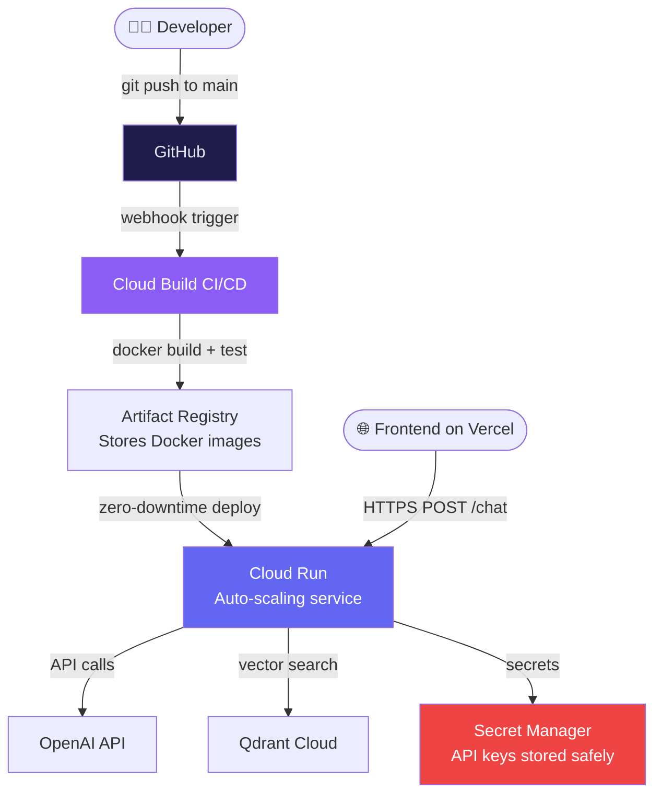

import FlashCardDeck from '@site/src/components/FlashCard';
import Quiz from '@site/src/components/Quiz';
import LessonComplete from '@site/src/components/LessonComplete';

# Deployment on Google Cloud Run

:::tip Learning Objectives — ⏱️ 45 min
- Understand why Cloud Run is ideal for AI agents
- Containerize your FastAPI agent with Docker
- Deploy with zero-downtime using CI/CD
- Configure secrets, scaling, and cost controls
:::

## Why Google Cloud Run for Agents?

AI agent backends have unique scaling needs: idle most of the time, then suddenly handling many concurrent requests. Traditional VMs charge 24/7 even when idle. Cloud Run solves this perfectly.

<div style={{display:"grid",gridTemplateColumns:"repeat(auto-fit,minmax(200px,1fr))",gap:"12px",margin:"20px 0"}}>
  <div style={{background:"#0f172a",border:"1px solid #22c55e40",borderRadius:"10px",padding:"14px"}}>
    <div style={{fontSize:"1.4rem"}}>💰</div>
    <div style={{color:"#4ade80",fontWeight:700,fontSize:"0.85rem",margin:"6px 0 4px"}}>Pay Per Request</div>
    <div style={{color:"#64748b",fontSize:"0.78rem"}}>$0 when idle. You only pay for actual compute time during requests. A low-traffic agent costs pennies per month.</div>
  </div>
  <div style={{background:"#0f172a",border:"1px solid #6366f140",borderRadius:"10px",padding:"14px"}}>
    <div style={{fontSize:"1.4rem"}}>⚡</div>
    <div style={{color:"#818cf8",fontWeight:700,fontSize:"0.85rem",margin:"6px 0 4px"}}>Auto-Scales</div>
    <div style={{color:"#64748b",fontSize:"0.78rem"}}>0 to 1000 instances automatically. Handles viral traffic spikes without any manual intervention.</div>
  </div>
  <div style={{background:"#0f172a",border:"1px solid #f59e0b40",borderRadius:"10px",padding:"14px"}}>
    <div style={{fontSize:"1.4rem"}}>🔒</div>
    <div style={{color:"#fbbf24",fontWeight:700,fontSize:"0.85rem",margin:"6px 0 4px"}}>Managed HTTPS</div>
    <div style={{color:"#64748b",fontSize:"0.78rem"}}>Automatic SSL certificates, custom domains, and a global load balancer. No nginx config needed.</div>
  </div>
  <div style={{background:"#0f172a",border:"1px solid #ec489940",borderRadius:"10px",padding:"14px"}}>
    <div style={{fontSize:"1.4rem"}}>🐳</div>
    <div style={{color:"#f472b6",fontWeight:700,fontSize:"0.85rem",margin:"6px 0 4px"}}>Any Container</div>
    <div style={{color:"#64748b",fontSize:"0.78rem"}}>Deploy any Docker container. Python, Node, Go — Cloud Run doesn't care about your stack.</div>
  </div>
</div>

---

## Deployment Architecture



---

## Step 1 — Production Dockerfile

```dockerfile
# ── Stage 1: Build dependencies ─────────────────────────────────────────────
FROM python:3.11-slim AS builder

WORKDIR /build

# Install build tools
RUN apt-get update && apt-get install -y --no-install-recommends \
    gcc g++ && rm -rf /var/lib/apt/lists/*

# Copy and install dependencies FIRST (Docker layer caching)
# If requirements.txt doesn't change, this layer is cached → fast rebuilds
COPY requirements.txt .
RUN pip install --no-cache-dir --user -r requirements.txt

# ── Stage 2: Runtime image ───────────────────────────────────────────────────
FROM python:3.11-slim AS runtime

WORKDIR /app

# Copy installed packages from builder
COPY --from=builder /root/.local /root/.local

# Copy application code
COPY . .

# Make sure scripts in .local are usable
ENV PATH=/root/.local/bin:$PATH

# Cloud Run injects PORT env variable (default 8080)
ENV PORT=8080

EXPOSE 8080

# Use exec form for proper signal handling (SIGTERM on shutdown)
CMD ["uvicorn", "main:app", "--host", "0.0.0.0", "--port", "8080", "--workers", "1"]
```

:::tip Why multi-stage build?
The builder stage installs gcc and build tools. The runtime stage only has the final installed packages — no build tools. Result: ~40% smaller image, faster deploys, smaller attack surface.
:::

---

## Step 2 — Set Up Google Cloud

```bash
# Install gcloud CLI (if not already installed)
# Mac:   brew install --cask google-cloud-sdk
# Linux: curl https://sdk.cloud.google.com | bash

# Login and set project
gcloud auth login
gcloud config set project YOUR_PROJECT_ID

# Enable required APIs
gcloud services enable \
  run.googleapis.com \
  cloudbuild.googleapis.com \
  secretmanager.googleapis.com \
  artifactregistry.googleapis.com

# Create Artifact Registry repository for Docker images
gcloud artifacts repositories create ai-agents-repo \
  --repository-format=docker \
  --location=us-central1 \
  --description="AI Agents Course containers"
```

---

## Step 3 — Store Secrets Safely

**Never put API keys in environment variables directly in deploy commands** — they appear in shell history and Cloud Build logs.

Use **Google Secret Manager** instead:

```bash
# Store each secret
echo -n "sk-proj-your-openai-key" | gcloud secrets create OPENAI_API_KEY \
  --data-file=- --replication-policy=automatic

echo -n "https://your-cluster.qdrant.io" | gcloud secrets create QDRANT_URL \
  --data-file=- --replication-policy=automatic

echo -n "your-qdrant-api-key" | gcloud secrets create QDRANT_API_KEY \
  --data-file=- --replication-policy=automatic

# List all secrets
gcloud secrets list
```

---

## Step 4 — Deploy to Cloud Run

```bash
# Build and push image to Artifact Registry
gcloud builds submit \
  --tag us-central1-docker.pkg.dev/YOUR_PROJECT_ID/ai-agents-repo/rag-api:latest \
  ./rag-agent

# Deploy to Cloud Run with Secret Manager integration
gcloud run deploy rag-api \
  --image us-central1-docker.pkg.dev/YOUR_PROJECT_ID/ai-agents-repo/rag-api:latest \
  --region us-central1 \
  --platform managed \
  --allow-unauthenticated \
  --memory 1Gi \
  --cpu 1 \
  --concurrency 80 \
  --timeout 300 \
  --min-instances 0 \
  --max-instances 20 \
  --set-secrets "OPENAI_API_KEY=OPENAI_API_KEY:latest" \
  --set-secrets "QDRANT_URL=QDRANT_URL:latest" \
  --set-secrets "QDRANT_API_KEY=QDRANT_API_KEY:latest" \
  --set-env-vars "CORS_ORIGINS=https://your-frontend.vercel.app"
```

**Key flags explained:**

| Flag | Value | Why |
|---|---|---|
| `--memory 1Gi` | 1 GB RAM | Agents load models/embeddings — need more than 256MB |
| `--timeout 300` | 5 minutes | Long agent chains can take time — don't let them time out |
| `--concurrency 80` | 80 req/instance | FastAPI handles many concurrent requests per instance |
| `--min-instances 0` | Scale to zero | $0 when idle — great for dev/staging |
| `--max-instances 20` | Max 20 | Cost cap — prevents runaway scaling |

---

## Step 5 — GitHub Actions CI/CD

Every push to `main` automatically rebuilds and deploys. Zero-downtime rolling updates.

```yaml
# .github/workflows/deploy-backend.yml
name: Deploy RAG API to Cloud Run

on:
  push:
    branches: [main]
    paths: ["rag-agent/**"]   # only trigger on backend changes

jobs:
  deploy:
    runs-on: ubuntu-latest
    steps:
      - uses: actions/checkout@v4

      - name: Authenticate to Google Cloud
        uses: google-github-actions/auth@v2
        with:
          credentials_json: ${{ secrets.GCP_SA_KEY }}

      - name: Set up Cloud SDK
        uses: google-github-actions/setup-gcloud@v2

      - name: Build, Push, and Deploy
        working-directory: rag-agent
        run: |
          # Build and push Docker image
          gcloud builds submit \
            --tag gcr.io/${{ secrets.GCP_PROJECT_ID }}/rag-api:${{ github.sha }}

          # Deploy new version (zero-downtime rolling update)
          gcloud run deploy rag-api \
            --image gcr.io/${{ secrets.GCP_PROJECT_ID }}/rag-api:${{ github.sha }} \
            --region us-central1 \
            --platform managed

      - name: Verify deployment
        run: |
          URL=$(gcloud run services describe rag-api --region us-central1 --format 'value(status.url)')
          STATUS=$(curl -s -o /dev/null -w "%{http_code}" $URL/health)
          if [ $STATUS -ne 200 ]; then
            echo "Health check failed with status $STATUS"
            exit 1
          fi
          echo "✅ Deployed successfully: $URL"
```

**GitHub Secrets to add** (repo → Settings → Secrets → Actions):

| Secret | Value |
|---|---|
| `GCP_SA_KEY` | Google service account JSON key |
| `GCP_PROJECT_ID` | Your Google Cloud project ID |

---

## Step 6 — Update Frontend URL

Once Cloud Run gives you a URL like `https://rag-api-xxxx-uc.a.run.app`, update your frontend:

```bash
# In your frontend .env.local
NEXT_PUBLIC_RAG_API_URL=https://rag-api-xxxx-uc.a.run.app
```

And update CORS on Cloud Run:
```bash
gcloud run services update rag-api \
  --region us-central1 \
  --set-env-vars "CORS_ORIGINS=https://your-site.vercel.app"
```

---

## Monitoring Your Deployment

```bash
# View real-time logs
gcloud run services logs tail rag-api --region us-central1

# Check service health
gcloud run services describe rag-api --region us-central1

# View metrics (requests, latency, errors)
# Go to: console.cloud.google.com → Cloud Run → rag-api → Metrics
```

---

## 🃏 Flash Cards

<FlashCardDeck title="Cloud Deployment" cards={[
  { question: "Why use Cloud Run over a traditional VM for AI agents?", answer: "Cloud Run auto-scales from 0 to 1000+ instances, charges only for actual request time (not idle time), and requires zero server management. Perfect for agents that have bursty, unpredictable traffic." },
  { question: "What does 'scale to zero' mean and what is the tradeoff?", answer: "When no requests arrive, Cloud Run shuts down all instances (cost = $0). On the next request, it cold-starts a new instance adding ~1-2 seconds latency. Use min-instances=1 to avoid cold starts at the cost of always-on billing." },
  { question: "Why use Secret Manager instead of --set-env-vars for API keys?", answer: "Environment variables in deploy commands appear in shell history and Cloud Build logs. Secret Manager encrypts at rest, provides access audit logs, and lets you rotate keys without redeploying." },
  { question: "What does --timeout 300 do in Cloud Run?", answer: "Sets the maximum request duration to 5 minutes. Agent chains with many tool calls, large document processing, or parallel research can take minutes. Without this, requests would be killed after the default 60 seconds." },
  { question: "Why is multi-stage Docker build better than single-stage?", answer: "The builder stage installs gcc and build tools (needed to compile packages). The runtime stage only copies the final installed packages — no build tools. Results in ~40% smaller, more secure image." },
  { question: "What does the GitHub Actions health check step do?", answer: "After deploying, it calls /health endpoint and checks for HTTP 200. If the deployment is broken, the workflow fails and alerts you before any users hit the broken service." },
]} />

---

## 📝 Quiz

<Quiz title="Deployment Quiz" questions={[
  { question: "What is the main cost advantage of Cloud Run vs a VM for a dev API?", options: ["Cloud Run is always faster", "Cloud Run scales to zero and charges nothing when idle — a VM costs money 24/7 even if unused", "Cloud Run is free forever", "VMs don't support Python"], correct: 1, explanation: "A VM running 24/7 at $50/month costs $600/year even if you only use it an hour a week. Cloud Run at zero idle cost might cost $2/month for the same usage pattern." },
  { question: "What does --allow-unauthenticated do?", options: ["Disables HTTPS", "Makes the Cloud Run service publicly accessible without Google IAM authentication", "Removes API key requirements from your code", "Disables rate limiting"], correct: 1, explanation: "By default Cloud Run requires Google IAM auth. --allow-unauthenticated makes it a public API — necessary for your frontend to call it from a browser." },
  { question: "Why set --timeout 300 for an agent API?", options: ["Cloud Run default is 300s", "Agent chains with multiple tool calls can take 2-5 minutes — without this they'd be killed after 60 seconds", "Longer timeouts are cheaper", "It's required for Python"], correct: 1, explanation: "Default timeout is 60 seconds. A research agent doing 5 parallel searches, then analysis, then writing could easily take 2-3 minutes. Set timeout to match your longest expected request." },
  { question: "What happens on a 'cold start' in Cloud Run?", options: ["The database is reset", "A new container instance starts when there are no warm instances — adds ~1-2 second latency to the first request", "The deployment rolls back", "All requests fail"], correct: 1, explanation: "Cold start happens when min-instances=0 and no instances are running. Cloud Run starts a new container which takes 1-3 seconds. Use min-instances=1 to keep one warm instance if latency is critical." },
]} />

<LessonComplete lessonId="module-4/deployment-google-cloud" />
