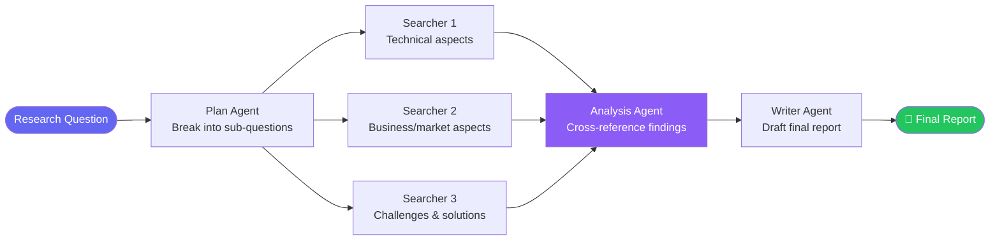

import FlashCardDeck from '@site/src/components/FlashCard';
import Quiz from '@site/src/components/Quiz';
import LessonComplete from '@site/src/components/LessonComplete';

# Research Agent

:::tip Learning Objectives — ⏱️ 45 min
- Build a full multi-step research pipeline from scratch
- Run search agents in parallel for speed
- Generate structured, cited research reports
- Handle real search APIs (Tavily/Serper)
:::

## What We're Building

A research agent that takes any topic and produces a comprehensive, cited report — automatically. It searches multiple sources in parallel, cross-references findings, and writes a structured analysis.

**Input:** "What are the main challenges of deploying LLMs in production?"
**Output:** A 500-word structured report with sections, bullet points, and citations.

This is useful for: competitive analysis, technical research, market reports, due diligence.

---

## Research Pipeline Architecture



**Why this design?**
- **Parallel search** = 3x faster (all search simultaneously)
- **Separate writer** = better quality (focused on writing, not searching)
- **Analysis step** = catches contradictions between sources
- **Planning step** = ensures comprehensive coverage

---

## Step 1 — Search Tools

```python
import asyncio
import httpx
import os
from agents import function_tool

@function_tool
async def search_web(query: str, num_results: int = 5) -> str:
    """
    Search the web for current information on any topic.
    Returns top search results with titles, snippets, and URLs.
    Use for: recent events, technical documentation, statistics, news.
    """
    try:
        # Option A: Tavily (best for AI agents — returns clean summaries)
        async with httpx.AsyncClient(timeout=10.0) as client:
            response = await client.post(
                "https://api.tavily.com/search",
                json={
                    "api_key": os.getenv("TAVILY_API_KEY"),
                    "query": query,
                    "num_results": num_results,
                    "include_answer": True,
                },
            )
            data = response.json()

        # Format results cleanly
        results = []
        if data.get("answer"):
            results.append(f"Quick answer: {data['answer']}\n")

        for item in data.get("results", []):
            results.append(
                f"**{item['title']}**\n"
                f"{item['content'][:300]}...\n"
                f"Source: {item['url']}\n"
            )

        return "\n---\n".join(results) if results else "No results found."

    except Exception as e:
        return f"Search error: {str(e)}. Try rephrasing the query."

@function_tool
async def fetch_webpage(url: str) -> str:
    """
    Fetch and extract the main text content from a webpage URL.
    Use this to read full articles when search snippets aren't enough.
    Returns the first 2000 characters of extracted content.
    """
    try:
        async with httpx.AsyncClient(timeout=15.0) as client:
            response = await client.get(
                url,
                headers={"User-Agent": "Mozilla/5.0 (Research Bot)"},
                follow_redirects=True,
            )
            # Simple text extraction (use BeautifulSoup in production)
            text = response.text
            # Remove HTML tags roughly
            import re
            clean = re.sub(r'<[^>]+>', ' ', text)
            clean = re.sub(r'\s+', ' ', clean).strip()
            return clean[:2000] + "..." if len(clean) > 2000 else clean
    except Exception as e:
        return f"Could not fetch {url}: {str(e)}"
```

---

## Step 2 — The Specialist Agents

```python
from agents import Agent

# Planning agent — breaks question into focused sub-questions
planner = Agent(
    name="Research Planner",
    instructions="""
    You are a research planning expert.
    Given a research question, generate exactly 3 focused sub-questions that together
    cover the full topic comprehensively:
    1. Technical/how-it-works angle
    2. Practical/real-world application angle
    3. Challenges/limitations/future angle

    Return ONLY the 3 questions as a numbered list. Nothing else.
    """,
    model="gpt-4o-mini",
)

# Search agent — finds information for one sub-question
searcher = Agent(
    name="Research Searcher",
    instructions="""
    You are a research specialist. For the given question:
    1. Search for current, authoritative information
    2. Search again with a different angle if first results are thin
    3. Return ALL relevant facts, statistics, and quotes you found
    4. Include source URLs with every claim

    Be thorough. More good information is better than less.
    """,
    tools=[search_web, fetch_webpage],
    model="gpt-4o-mini",
)

# Analysis agent — synthesizes findings from all searchers
analyst = Agent(
    name="Research Analyst",
    instructions="""
    You are a research analyst. Given research findings from multiple sources:
    1. Identify common themes and agreements
    2. Note contradictions or conflicting information
    3. Highlight the most important and well-supported facts
    4. Identify gaps in the research
    5. Produce a concise analysis brief (not the final report — just key insights)
    """,
    model="gpt-4o",
)

# Writer agent — produces the final polished report
writer = Agent(
    name="Research Writer",
    instructions="""
    You are an expert technical writer. Write a comprehensive research report.

    Format:
    # [Report Title]

    ## Executive Summary (3-4 sentences)

    ## Key Findings
    (4-6 bullet points with the most important discoveries)

    ## Detailed Analysis
    (2-3 paragraphs with depth and nuance)

    ## Practical Implications
    (What should readers DO with this information?)

    ## Sources
    (List all URLs cited)

    Style: Professional but accessible. Avoid jargon without explanation.
    Use bold for key terms. Be specific — cite numbers and statistics when available.
    """,
    model="gpt-4o",  # Best model for final output quality
)
```

---

## Step 3 — The Research Pipeline

```python
async def run_research(topic: str) -> str:
    """Run the full research pipeline on a topic."""

    print(f"\n🔍 Researching: {topic}")
    print("=" * 60)

    # Stage 1: Plan — generate 3 focused sub-questions
    print("\n📋 Stage 1: Planning research angles...")
    plan_result = await Runner.run(planner, f"Research topic: {topic}")
    sub_questions = plan_result.final_output.strip().split("\n")
    print(f"Sub-questions:\n{plan_result.final_output}")

    # Stage 2: Search — run ALL sub-questions in PARALLEL
    print("\n🌐 Stage 2: Searching all angles simultaneously...")
    search_start = asyncio.get_event_loop().time()

    search_tasks = [
        Runner.run(searcher, f"Research this thoroughly: {q}")
        for q in sub_questions
        if q.strip()
    ]
    search_results = await asyncio.gather(*search_tasks)

    search_time = asyncio.get_event_loop().time() - search_start
    print(f"✅ Parallel search completed in {search_time:.1f}s")

    # Combine all search findings
    combined_findings = "\n\n".join([
        f"### Findings for: {q}\n{r.final_output}"
        for q, r in zip(sub_questions, search_results)
        if q.strip()
    ])

    # Stage 3: Analyze — cross-reference and synthesize
    print("\n🧠 Stage 3: Analyzing findings...")
    analysis_result = await Runner.run(
        analyst,
        f"Analyze these research findings about '{topic}':\n\n{combined_findings}"
    )

    # Stage 4: Write — produce the final report
    print("\n✍️  Stage 4: Writing final report...")
    report_result = await Runner.run(
        writer,
        f"""
        Topic: {topic}

        Research findings: {combined_findings}

        Analysis: {analysis_result.final_output}

        Write the comprehensive research report now.
        """
    )

    print("\n✅ Research complete!")
    return report_result.final_output


async def main():
    report = await run_research(
        "What are the main challenges of deploying LLMs in production?"
    )
    print("\n" + "=" * 60)
    print("FINAL REPORT")
    print("=" * 60)
    print(report)

    # Save to file
    with open("research_report.md", "w") as f:
        f.write(report)
    print("\n📄 Report saved to research_report.md")

asyncio.run(main())
```

---

## Expected Output

```markdown
# LLM Production Deployment: Challenges and Solutions

## Executive Summary
Deploying Large Language Models in production environments presents
significant challenges across cost, latency, reliability, and safety.
While frameworks have matured rapidly in 2024, organizations report
that 60-70% of LLM projects fail to reach production...

## Key Findings
- **Cost**: GPT-4o costs ~$2.50/1M tokens; at 1M requests/day with
  average 500 tokens, that's $1,250/day in API costs alone
- **Latency**: Average response time is 2-8 seconds — too slow for
  many real-time applications without streaming
- **Hallucination rate**: Even GPT-4o hallucinates ~3-5% of the time
  without RAG grounding...

## Sources
- https://arxiv.org/abs/2401.xxxxx
- https://openai.com/blog/...
```

---

## 🃏 Flash Cards

<FlashCardDeck title="Research Agent" cards={[
  { question: "Why use asyncio.gather() for the search stage?", answer: "It runs all search queries simultaneously instead of one-by-one. 3 searches that each take 5 seconds complete in 5 seconds total with gather — instead of 15 seconds sequentially." },
  { question: "Why use GPT-4o for the Writer agent but GPT-4o-mini for Searcher?", answer: "Search is a simple task (search + extract). Writing requires nuanced language, structure, and synthesis — GPT-4o produces significantly better reports. Match model power to task complexity." },
  { question: "What does the Planner agent do?", answer: "Breaks the broad research topic into 3 focused sub-questions covering different angles (technical, practical, challenges). This ensures comprehensive coverage and guides the parallel searches." },
  { question: "What is Tavily and why is it good for agents?", answer: "Tavily is a search API built specifically for AI agents. It returns clean, summarized content instead of raw HTML. It also provides a 'quick answer' for simple factual queries." },
  { question: "Why have a separate Analysis stage before writing?", answer: "Multiple search results may contradict each other or overlap. The Analyst identifies key insights, notes contradictions, and produces a brief that guides the Writer — preventing a jumbled, repetitive report." },
  { question: "How do you prevent the research agent from hallucinating facts?", answer: "Always search before writing. The Writer agent receives actual search results as input — it has real data to work from. Prompt it explicitly to cite sources and not invent statistics." },
]} />

---

## 📝 Quiz

<Quiz title="Research Agent Quiz" questions={[
  { question: "What is the main speed benefit of the parallel search pattern?", options: ["It costs less", "3 searches that each take 5 seconds complete in 5 seconds total instead of 15 — 3x faster", "It's required by Tavily API", "It reduces hallucinations"], correct: 1, explanation: "asyncio.gather() runs coroutines concurrently. N parallel searches complete in max(individual times) instead of sum(individual times). For 3 searches: 5s vs 15s." },
  { question: "Why separate the Research and Writing agents?", options: ["One agent can't do both", "Separation of concerns — Researcher focuses on finding facts, Writer focuses on clear communication. Each does what it's optimized for.", "Two agents always produce better results", "Writers cost less to run"], correct: 1, explanation: "Mixing search and writing in one agent produces mediocre results at both. The researcher digs deep; the writer polishes and structures. Specialists outperform generalists." },
  { question: "What is the risk of running a research agent WITHOUT search tools?", options: ["It will be too slow", "It will hallucinate facts from training data — which may be outdated, incorrect, or fabricated", "It costs more tokens", "It won't start"], correct: 1, explanation: "LLMs have training cutoffs and confidently produce false 'facts'. Always ground research agents with real-time search tools to ensure accuracy and currency." },
  { question: "What should the Analysis stage catch before writing?", options: ["Grammar errors", "Contradictions between sources, key themes, and gaps in research coverage", "Token overuse", "Wrong model selection"], correct: 1, explanation: "Different search results may contradict each other. The analyst identifies what's well-supported, what conflicts, and what's missing — preventing the writer from presenting contradictory info as fact." },
]} />

<LessonComplete lessonId="module-4/research-agent" />
